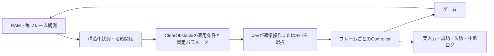

> 現在の起動ファイルは連続Skillモードです。[最新の実行構成と検証結果](continuous-skill-runtime.md)を参照してください。以下は旧停止型モードの設計・変更履歴です。

# ClearObstacle：意味のある操作とフレーム制御の分離

## 実装と今回の結果

2026-09-24。JevがClearObstacleを選び、固定パラメータのコントローラーが毎フレーム観測して障害物を越える実験モードを実装した。

固定場面のAPIなし検証では、ログの各判断開始位置にずれがないことを確認してから実行した。

| 開始位置 | 障害物 | 結果 |
|---|---|---|
| x434 | 2段 | 向こう側x508、地面に着地、成功 |
| x594 | 3段 | 向こう側x676、地面に着地、成功 |
| x722 | 4段 | 対象外。候補を出さない |

x594では敵が離れて開始条件を満たすまで待った。すべての同じ高さの障害物で成功するという検証ではない。

実Jev＋画面表示の最終試行（run-20260924T032100.031751Z）では、Jev自身が判断19と28でClearObstacleを選び、2回とも成功（着地x506とx676）。最大到達位置はx1112、100判断の上限まで死亡せず実行。4段の障害物では停滞したが、既存の操作・マクロで最終的に通過した。4段通過はClearObstacleの成果として数えない。

以前の待ち停止試行は最大x723だったが、1試行同士・実行器の差もあるため、ゲーム全体の性能改善が証明されたとは言えない。今回確認したのはSkill選択→実行→成功判定の成立。

初期試行では助走中にも候補を出してしまい、着地範囲を越えて失敗した。その結果を受け、最終版は速度の絶対値1px/frame以下・障害物1タイル先・高さ2〜3に限定。失敗ログも保持している。

## 分離した役割



- 対象・関係：既存state.pyの駒、敵、足場、障害物高さ、位置、接地など。
- Skill適用規則：skills.pyのclear_obstacle_candidate。オントロジー上の対象・関係を使う行動の前提条件に相当する。RDF/OWLによる表現ではなくPython関数。
- 戦略判断：policy.pyでJevへ通常操作と実行可能なSkillを渡す。ローカルルールでJevの選択をSkillへ置き換えない。
- パラメータ：コードで固定したジャンプ保持30フレーム、踏切位置、観測済みの着地範囲、最大180フレーム。Jevが自由な数値を生成する方式ではない。
- 実行：skills.pyのClearObstacle。ジャンプ開始、保持、必要なら障害物上の移動、減速、着地確認を毎フレーム更新。
- 接続・記録：skill_runner.py。既存のリアルタイムrunnerとは別の、応答待ち停止型の実験用実行器。

## 開始・終了の契約

開始条件：接地、既知の地形、1タイル先の2〜3段障害物、速度の絶対値1以下、後方の足場、障害物の向こう3タイルの地面・空間、近くに敵がいないこと。パラメータ付き候補をJevへ渡し、実行直前も条件を確認する。

成功：離陸を観測し、障害物の向こうの着地範囲内で、開始時とほぼ同じ高さの地面への接地を観測する。横位置を越えただけ、障害物上に乗っただけでは成功にしない。

失敗：死亡、パワーダウン、着地範囲外、時間切れなど。中断：近距離に敵が入る、退避中の足場が失われる、ユーザー停止など。結果が成功でない場合、この実験モードはゲームを停止して記録する。空中で中断しても自動的に安全な着地を保証する機能ではない。

成功確率は未評価としてnull。期待する結果・リスクの説明は渡すが、確率やJevの理由文を作り上げない。

## 記録

artifacts/skills/配下に専用JSONLを保存。従来のdecision専用ログとは混ぜない。

- run_start：seed、環境、モード、版、ソースハッシュ、上限。
- decision：Semantic State、選ばれた操作/Skill、確率、遅延、パラメータ。Jevは理由文を返さないのでselection_reasonはnull。
- controller_frame：実際の入力、実行段階、入力前後の位置・速度・接地、報酬、環境終了。
- skill_result：成功/失敗/中断/拒否、理由、実行フレーム数、実行後の状態。
- episode_end：終了理由、最大到達位置、最終状態。

失敗理由はControllerで観測した条件であり、「Jevの選択は正しかった」といった因果評価を自動で確定するものではない。

## 実行

```sh
PYTHONPATH=src .venv/bin/python -m typesafe_mario.cli play --policy direct --skills --display dashboard --max-decisions 100
```

--skillsは推論待ち中にゲームを止める実験モード。通常起動の挙動は変えない。Skill実行中はAPIを呼ばず、画面を表示しながら毎フレーム操作する。上限・死亡・Skill失敗で終了し画面を閉じる。Q/Escで終了。実験モードではRも終了として扱い、次の試行はコマンドから起動する。

固定場面の再現：

```sh
PYTHONPATH=src .venv/bin/python scripts/validate_obstacle_skill.py
```

結果：artifacts/clear-obstacle-validation-0.json。元ログと操作の保持仕様に依存するため、別のログへ無条件に使える一般再生器ではない。

## 次の検証

1. 4段障害物用に、後退・助走を含む別パラメータ候補を固定場面で検証する。
2. 現在のSkillの開始位置・速度・敵配置を変え、適用条件が十分か確認する。
3. 同一実行器・同一条件でSkillあり/なしを複数回比較する。
4. その後に推論待ちも進むリアルタイム環境へ拡張し、遅延を別評価する。

## 進捗監視（2026-09-24追加）

--skillsの実験モードでは、8px以上の新しい到達位置を進捗として扱う。過去に到達した位置への戻りや、土管前の数pxの揺れでは停滞を解除しない。

- 12判断、または180ゲームフレーム進捗がなければ、次のJev問い合わせ前に停滞と判定する。壁時計のAPI待ち時間は数えない。
- 検証済みClearObstacleの開始条件を満たす場合のみ、1ゲームにつき最大1回、自動回復を実行する。
- 回復手段がなければstalled_no_safe_recoveryで終了する。
- すでに回復を使った後の停滞はstalled_recovery_exhaustedで終了する。
- 回復Skill自体の失敗・中断は既存のskill_failure/skill_abortedで即終了する。
- Skill内部は引き続き最大180フレームで終了する。Skill実行中に新しい回復処理を割り込ませない。

追加イベント：stall_detected、recovery_started、recovery_result。decision_sourceはjevまたはprogress_recovery。後者はローカルの回復処理でありJevの意思決定成績に混ぜない。

この変更はSkill実験モードに適用される。通常のリアルタイムモードや未検証の4段障害物の制御を改善したものではない。

## 画面から検証を起動する

2026-09-24、Start Jev Mario.commandをSkill・停滞監視モードの起動用に更新した。このファイルをFinderでダブルクリックすると、--skills --display dashboard --max-decisions 100で起動する（以前は通常モードだった）。ターミナルは検証終了後も残り、終了理由とログ保存先を確認してEnterで終了できる。次の検証は同じファイルを再度開く。

起動経路の実走確認：artifacts/skills/run-20260924T035209.932311Z.jsonl。22判断、最大x436、skill_failureで終了。これは起動・記録・終了の確認であり、障害物通過の改善を示す結果ではない。

## v2：土管の1px押し戻しによる踏切停止を修正

2026-09-24。直近3本のSkill失敗は、開始x435を踏切位置に設定した後、衝突解決でx434へ押し戻され、approachのまま180フレーム右入力を続ける不具合だった。敵・高度・着地以前にジャンプが始まっていなかった。

踏切判定に接地条件と2pxの許容幅を設けた。離れた位置や空中での誤発動を防ぐテストも追加。版はclear-obstacle-v2。

scripts/replay_skill_failure.pyで保存済みの実入力を再生し、失敗直前まで座標の一致を確認。修正前は3本ともx434で180フレーム後timeout、修正後は3本とも54フレームでx504へ安全に着地。3本は同じ場面の再現であり、異なる条件での成功率推定ではない。既存のx434/x594の固定場面も通過。

実Jev・画面表示：artifacts/skills/run-20260924T035704.699922Z.jsonl。判断21で2段をx504へ、判断30で3段をx676へ通過。未対応の4段土管で停滞し、最大x725、46判断後stalled_no_safe_recoveryで終了。100判断まで繰り返さず停止した。4段対応は未実装。

検証結果：87テスト成功、既知のexpected failure 2件。起動ファイルの操作は変更不要で、次回起動からv2を利用する。

## 最後まで続行するモード（当時の起動設定）

Start Jev Mario.commandは--skills --until-game-overで起動する。100判断による終了と、停滞・Skill失敗による自動終了を無効にした。これらはログへ記録し、回復が使える場合は1回試し、その後もJevへ判断を戻す。ゲーム内の時間は操作ごとに進み、死亡・クリア・環境の終了、またはEsc/Qで終わる。自動で新しいゲームを再開する機能ではない。通信エラー等による異常終了は別扱い。

個々のSkillの180フレーム制限は残す。Skillだけを終了させ、ゲーム全体は続ける。上限付き比較を行いたい場合は--until-game-overを外し、--max-decisionsを指定する。

検証：固定環境の統合テストで、停滞と回復Skill失敗を挟んでも100回を超えてJev判断を続け、環境終了時に停止することを確認。

## 接続先：TypeSafe直接接続

起動ファイルは--policy directを指定する。テトリスと同じgateway/systemone.mjsクライアント・jev-latestモデル・TypeSafe System One APIを使用し、TYPESAFE_API_KEYを.envから読む。キーがなければ停止し、Vercelへフォールバックしない。実応答のroute=directを確認済み。decisionログにもrouteを保存する。旧--policy vercelは互換性のため自動選択を維持しており、以前もTypeSafeキーがある場合は直接接続を優先していた。
