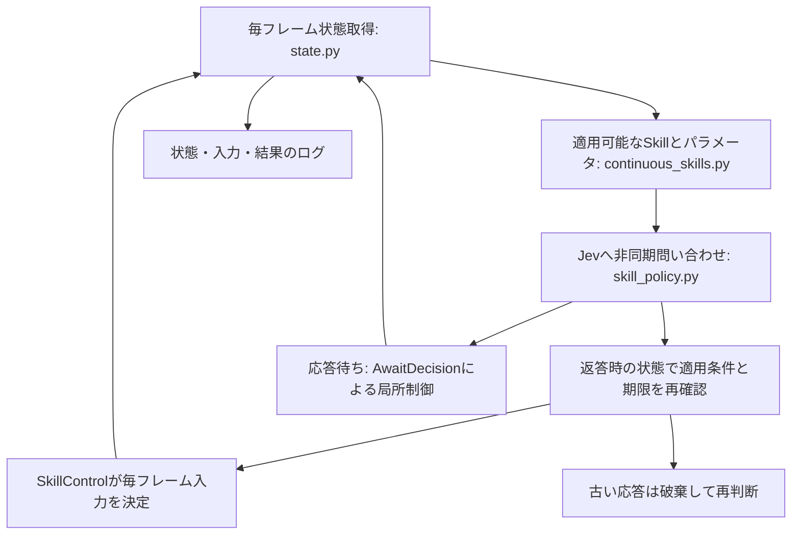

# ゲーム全体の連続Skill実行基盤

2026-09-24。版: continuous-skills-v16。通常移動も含めてSkillで制御し、Jevの応答待ち中もゲームを進める足場を実装した。ゲームを最後まで制御する経路が揃ったという意味であり、全障害物の攻略やクリアを保証するものではない。

## 起動

Finderで `Start Jev Mario.command` を開く。現在の起動設定は次の通り。

```sh
PYTHONPATH=src .venv/bin/python -m typesafe_mario.cli play --policy direct --continuous-skills --display dashboard --until-game-over --interactive-session
```

TypeSafeへの直接接続でJevを使用する。Vercelへの自動切り替えはしない。100判断では終了せず、停滞・個別Skill失敗でも判断を続ける。死亡・クリア・環境終了・Q/Escの手動操作で終了する。APIエラーは記録して終了する。終了後も画面を残す。RestartボタンまたはRで新しい試行を開始する。プレイ中のRestartも可能で、旧試行のログとAPI接続を閉じてから新規に開始する。自動リスタートはしない。

旧 `--skills` は応答待ち中にゲームを止める比較用モードとして残した。

## 処理と実装の対応



実行の統括は `continuous_runner.py`。一度に問い合わせるのは1件。Jevが選ぶのは実行可能なSkill候補で、各フレームのボタン入力はローカルの制御器が決める。応答を受け取った時点で候補の適用条件と45ゲームフレームの期限を再確認する。

待機中も最新状態を使い、減速、空中の前進、近い敵への緊急ジャンプを行う。この局所制御はJevの判断とは区別して記録する。安全が保証された制御ではなく、今後の調整対象である。

| Skill | 役割 |
|---|---|
| Advance | 通常の前進。危険接近や離地で再判断へ戻す |
| WaitForOpening | 短い待機・減速 |
| Survey | 短く待って再観測 |
| JumpOverEnemy | 敵を越えるジャンプ |
| CrossGap | 穴の向こうへのジャンプ |
| ClearObstacle | 検証済み条件の障害物を越える既存制御 |
| RecoverObstacle | 後退・助走・再ジャンプによる回復の試行 |
| LandForward | 空中で前進し着地を確認 |
| ContinueJump | 上昇中のジャンプ保持と着地確認 |

各Skillはフレーム予算、成功・失敗・再判断の条件を持つ。Skillが終わってもゲーム全体は続行する。停滞時には適用条件が合う局所回復を1ゲームにつき1回試す。

## 固定する定義と改善する制御

対象・位置・敵・穴・障害物という状態記述から、Skill適用条件を導く部分がオントロジーとの接続に相当する。RDF/OWL形式ではなくPythonで実装している。

ジャンプ保持時間、危険を検出する距離、応答期限、待機中の入力などは制御の調整値であり、対象の定義と同じ意味で不変ではない。比較時にはソース版・条件を固定し、変更した制御と結果を比較する。成功確率は未推定なのでnullとし、Jevが返していない選択理由や確定的な失敗原因を捏造しない。

## 記録と分析

`artifacts/continuous-skills/` にJSONLと自動集計の `.summary.json` を保存する。

- 問い合わせ時の状態、候補、直近のSkill結果
- Jevの応答、確率、API経路、所要時間
- Skillの開始・結果、応答を破棄した理由
- 毎フレームの前後状態、入力、制御元、フェーズ、問い合わせ中かどうか
- 停滞・回復・終了理由、到達位置、ソースハッシュ

制御元は `jev`、`local_handoff`、`local_recovery` に分ける。API障害は例外種別を記録し、秘密情報を含み得る生のエラーテキストは保存しない。

```sh
PYTHONPATH=src .venv/bin/python scripts/analyze_continuous_skills.py
```

全ログを再集計する。特定のJSONLパスを引数に指定することもできる。集計は到達位置、待機中フレーム数、応答破棄数、Skill別の終了結果など。自動学習や自動的なパラメータ更新はまだ行わない。

## 実走結果と次の改善

| ログ | 最大x | ゲームフレーム | 結果 |
|---|---:|---:|---|
| run-20260924T041938.625322Z.jsonl | 306 | 148 | 死亡 |
| run-20260924T042243.019185Z.jsonl | 305 | 154 | 死亡 |

両方とも直接接続で通常前進Skillが85フレーム動作し、応答待ち中もゲームが進んだ。敵へのジャンプ応答は待機中の緊急ジャンプ後に届き、適用条件が変化していたため破棄された。動作経路と記録は確認できたが、得点・到達距離の改善は示していない。

次の調整は、敵接近時の判断開始を早めることと、待機制御からJumpOverEnemyへの切り替えである。状態認識の精度や敵との衝突を併せて確認し、死亡原因を意思決定だけに帰属させない。ClearObstacle以外の制御も実環境での調整が必要で、特に4段障害物の安定通過は未確認。


## v2: 応答待ちのジャンプを途中で解除しない（2026-09-24）

v1の失敗ログを再生すると、緊急ジャンプを開始した次のフレームもgroundedがtrueであり、前回ジャンプ入力を見たコードがAを解除していた。x276・速度1px/frameから、従来制御は最高y103でx306死亡、入力を保持する対照試験は最初の敵を越えた。通信遅延だけではなく、離地を観測するまでの入力保持に欠陥があった。

v2は局所ジャンプ開始後、離地と着地を毎フレーム観測しながらA+B+右を最大30フレーム保持し、その後は前進する。着地・死亡・80フレーム上限で制御を終了する。着地前に返ったJev応答はhandoff_committedとして破棄し、局所ジャンプへ別のSkillを割り込ませない。この期間は新しい問い合わせもしない。Jev選択ではないことをlocal_handoffとして引き続き明示する。

併せて、前進Skillを無効にする敵判定へ縦距離を追加した。土管上から56px下にいる敵まで横距離だけで危険扱いし、待機しか選べなくなる事象を修正した。着地先の安全を保証する変更ではない。

`PYTHONPATH=src .venv/bin/python scripts/verify_handoff_replays.py` で直近4本の旧失敗ログの入力を再生できる。修正対象までの位置差は全て0、修正後はいずれも生存してx402到達。ただし共通する初期場面の回帰検証であり、独立した4種類の場面での成功率を表すものではない。

判断開始を早めるだけの変更は採用していない。APIを使わない条件別試験では早すぎるジャンプもブロックとの接触などで失敗したため、まず確認できた入力保持の欠陥を直した。ゲームを停止して通信を待つ方式には戻していない。

### v2の実API検証

全てseed=123、TypeSafe直接接続、60fps指定の連続制御。試験用上限45判断を設定したが、全試行が上限前の死亡で終了した。初期条件は同じで、API応答時間と選択は試行ごとに異なる。

| ログ時刻（2026-09-24 UTC） | 最大x | 判断数 | 終了 |
|---|---:|---:|---|
| 04:42:47.494188 | 825 | 13 | 死亡 |
| 04:43:41.737458 | 1416 | 22 | 死亡 |
| 04:44:02.931407 | 1127 | 19 | 死亡 |
| 04:44:21.150215 | 1428 | 21 | 死亡 |

4/4で以前の到達位置x725を超えた。平均1199、中央値1271.5。比較対象の旧停止型x725は1試行であり、統計的な優位性やクリア率は主張しない。ここで確認できたのは、直近の最初の敵で繰り返し死ぬ回帰を解消し、旧到達位置を再び超えたことである。次の課題は先の穴・敵・着地に対する制御であり、自動学習は行っていない。

テスト: 105 passed、既知のexpected failure 2件、7 subtests passed。変更ファイルのruff検査成功。


## v3: CrossGapの助走と踏切（2026-09-24）

失敗ログでは、Jev待ちでほぼ停止した位置（例x1062）から直ちにジャンプし、穴の手前で空中移動の多くを使っていた。v3は地上で見えた穴の開始・終了を世界座標に固定し、開始位置の16px手前までAを離したまま右+Bで助走する。そこでA+B+右へ切り替え、30フレーム保持した後も前進し、実際の着地を確認する。飛行中に信頼度が低くなった地形から踏切位置を再計算しない。

Jev応答時には、同じ穴の両端を認識しているか再検証する。Skill全体の上限は120フレーム。助走前に足場を失った場合や踏切を逃した場合は、原因を記録してSkillを中断する。最大飛距離や安全な着地を全場面で保証するものではなく、頭上障害物・着地点の敵・短い助走区間は別途検証が必要。

ログにはgap_runup、gap_jump_hold、gap_landingの各段階、穴の両端、踏切位置、実際の速度と入力を残す。比較用スクリプト:

```sh
PYTHONPATH=src .venv/bin/python scripts/verify_gap_replays.py
```

旧失敗ログ5本を操作入力から再現し、修正対象までの位置差0を確認。その状態からv3を実行すると5/5で対岸へ着地した。対象は2種類の穴であり、未知の穴への成功率を示すものではない。結果はartifacts/handoff-debug/gap-replay-results.jsonに保存。

テスト: 107 passed、既知のexpected failure 2件、7 subtests passed。変更ファイルのruff検査成功。

### v3の通し検証と参考知見

実Jev・seed123・60fps指定・最大60判断で3回実行。最大xは2147、2146、2148。全試行で最初の2つの穴をCrossGapで越え、計6回の対岸着地を記録した。その先で停滞し、いずれも試験用判断上限で終了。死亡・クリアまでの完走検証ではない。ユーザー用ランチャーのuntil-game-overは維持している。

ログ: run-20260924T045349.946264Z、run-20260924T045436.671292Z、run-20260924T045522.651108Z（artifacts/continuous-skills）。

参考: [初代マリオのゲーム性・レベルデザインを今更まとめてみる](https://note.com/kk09020/n/n45495cd26849)。ジャンプ保持・慣性・空中操作の制約という観点を、検証項目の整理に使う。記事は具体的な物理パラメータの仕様書ではないため、踏切距離や入力時間の根拠には今回のエミュレータの再現試験を用いる。レベルデザイン・フロー理論は今回の制御修正には採用しない。


## v4: 1段上の足場へ移るClimbStep

階段のx2146付近では高さ1タイルの障害物を正しく認識していたが、ClearObstacleは2〜3段かつ背後が平坦という条件、RecoverObstacleも背後の平坦な足場を要求するため、候補がWaitForOpeningとSurveyだけになっていた。これは通信停止ではなく、適用可能なSkillの不足。

ClimbStepを追加。地上で前方1〜2タイルの1段の障害物を観測し、近い同高度の敵がいない場合に候補へ出す。Aを一度離して前進ジャンプを24フレーム保持し、着地が目標x以降かつ元より1段高い位置にあるか確認する。上限80フレーム。実行前に段差位置と目標高さを再検証する。階段の座標を実装へ埋め込んではいない。

scripts/verify_step_replays.pyで旧停滞ログ3本を再現したところ、開始まで位置差0、すべてx2192〜2193の上段へ着地した。これは局所制御の検証。通常の実Jev通し試行2回はx2006・664で死亡し、階段まで届かなかったため、この2回から階段通過や全体性能向上は主張できない。

scripts/verify_step_jev.pyは旧ログの階段状態を再生してから実Jevへ引き継ぐ診断用。ログはartifacts/step-resumedに分離し、origin.jsonに再開元を残す。通常のゲーム全体比較には含めない。

テスト108件成功、既知のexpected failure 2件、7 subtests passed。

実Jevで階段状態から再開した診断ではClimbStepが選択され、x2146→2192の上段へ着地した。その後、階段の間へ降りてx2226（地上、前方4段壁）で候補が待機だけとなり、20判断上限で終了。階段全体の通過は未解決。次の対象は上段から対向する上段への移動と、谷へ降りた後の復帰であり、今回の1段を上るSkillがそれを解決したとは扱わない。診断ログ: artifacts/step-resumed/continuous-skills/run-20260924T050053.507112Z.jsonl。


## v5: 階段の登頂と谷越えを連続実行するCrossStaircase

1マスの頂上に到着してから待機制御で減速すると、停止までの移動量で谷へ降りてしまうことを再現した。そこでCrossStaircaseを追加し、Jevが階段の手前で選択した後は「登頂→着地確認→ジャンプボタンを1フレーム解除→谷越え→対岸側の足場への着地」をAPI待ちなしで実行する。ゲームを停止させる処理ではない。

適用条件は、地上で認識できる1段ずつ上昇する1〜3段の階段、1〜3タイルの谷、その先に見える同じ高さの足場。近い敵がいる場合は候補にしない。遠く後方の敵では無効化しない。頂上と対岸の座標は観測したグリッドから計算し、固定のステージ座標ではない。対応する地形では単独ClimbStepの代わりに候補へ出す。登頂位置・高さが想定と違う場合は、谷越えに進まず失敗を記録する。Skill全体の上限180フレーム。途中の各段階はstair_climb_*、stair_cross_*として記録する。

対岸の狭い頂上に静止するSkillではなく、谷を越えて対岸側（下り階段やその先を含む）の足場に着地するSkill。到達xだけで成功にせず、着地と生存を確認する。離れたステージや任意の階段への一般化は未検証。

検証:
- scripts/verify_staircase_replays.py: 旧停滞ログ3本で再現位置差0、3/3成功、x2368〜2370へ着地。
- 実Jevによる階段状態からの再開診断: CrossStaircaseを選択しx2146→2368を96フレームで通過。その後最大x2571まで進むが別地点で停滞し、20判断上限で終了。通常の最初からのゲーム比較には含めない。
- 診断ログ: artifacts/step-resumed/continuous-skills/run-20260924T050739.324419Z.jsonl。
- この変更によって全ステージの停止を解消したとは主張しない。

最初からの追加1試行はx656で死亡し階段へ未到達。したがって、全体性能の改善をこの試行からは判断できない。テスト113件成功、既知のexpected failure 2件、7 subtests passed。変更ファイルのruff成功。


## v6: 土管越えの適用位置まで近づくApproachObstacle

x2571の停滞は、3タイル前方の2段土管を通常前進の停止条件で避ける一方、ClearObstacleは1タイル手前でのみ適用できるため、候補が待機だけになることが原因だった。

ApproachObstacleを追加。2〜4タイル前方の2〜3段の障害物、観測範囲内に穴がなく足元が確認でき、近い敵がいない場合に選択可能。右入力で距離を詰め、1タイル以内で速度が1px/frame以下になったら成功し、Jevの次の判断へ戻す。離地・穴・敵など条件変化では中断。上限90フレーム。障害物位置を応答時にも照合する。

これは接近と跳躍の適用条件の隙間を埋めるSkillであり、単に「危険でも前進し続ける」ように緩和したものではない。

実Jevの停止位置からの再開診断: ApproachObstacleでx2571→2594、ClearObstacleでx2594→2668の着地を確認。その後x2850で死亡したため、今回の停滞の解消とゲーム全体の安定性は区別する。ログはartifacts/pipe-resumed/continuous-skills/run-20260924T051836.554868Z.jsonl。再現スクリプトはscripts/verify_pipe_jev.py。途中再開のため最初からの比較には使わない。

Skillの目的・適用条件・対象との関係・成功条件はオントロジーに含めてモデル化できる。フレームごとの入力コードはそれに結び付く実行実装として区別する。このプロジェクトではPythonで表現しており、RDF/OWLへの移行はしていない。

同じ土管前状態からの実Jev再開診断2回目はclear、最大x3161、17判断で終了（run-20260924T051907.088015Z.jsonl）。最初からの通しクリアではなく、停止位置以降のクリアを確認した結果。全テスト115件成功、既知のexpected failure 2件、7 subtests passed、ruff成功。


## v7: 後方から接近する敵への回避

EvadeRearEnemyを追加。後方80px以内、足元と近い高さ、相対速度が接近方向、推定接触まで24フレーム以内という条件を使う。接触時間は衝突幅の余裕12pxを引いた距離/相対速度という近似であり、物理的な保証ではない。遠ざかる敵や別高度の敵は対象外。

Survey、WaitForOpening、後退回復、障害物への接近中は、後方危険を検出したら次の選択へ移る。Jevへも危険情報と回避Skillを渡す。API待ち中は同じ制御をlocal_handoffとして実行し、確定した回避中に古いAPI応答を割り込ませない。

前方3タイルが同じ高さの足場で、低い障害物や近い前方の敵がなく、接触まで8フレーム超なら走って離れる。それ以外は前進入力を加えずジャンプし、24フレームの保持と着地確認を行う。既存の横速度が完全に消えるわけではなく、天井・接触直前・複数の敵などに対する安全は未保証。回避には80フレームの上限を設け、着地後は再評価する。これは空中の全Skillを強制中断する仕組みではない。

ログには後方距離・接近速度・推定接触時間と、rear_escape_forward / rear_jump_hold / rear_jump_landingのフェーズを保存する。離れた敵への不要なジャンプ、穴方向への前進、離地観測の1フレーム遅れによるA解除を回帰テストで確認する。

実ログ再現: scripts/verify_rear_replay.py。土管再開試行の元ログを含めて操作を再生し、x2782・後方29px・接近1px/frameから比較。記録通りの操作は141フレーム後に死亡、局所回避だけを使った対照試験は同じ141フレームで生存（x2827）。後者はその後のJev判断を再現したものではなく、回避局所の検証でありクリア率比較には使わない。出力: artifacts/handoff-debug/rear-replay-results.json。

追加検証で、土管前の垂直ジャンプだけでは元の位置へ着地して再接触する例を確認した。そのため、穴が見えず前方1〜2タイルの1〜3段障害物を観測できた場合のみ、障害物の上面より8px高くなってから前進して上へ逃げる処理を追加した（rear_jump_onto_obstacle）。穴の前ではこの前進を使わない。

最終版の実Jev・土管前からの再開診断は最大x3034、20判断上限で終了。ログ: artifacts/pipe-resumed/continuous-skills/run-20260924T053132.555638Z.jsonl。途中再開かつ判断上限付きなので通しクリアや成功率の主張には使わない。全テスト121件成功、既知のexpected failure 2件、7 subtests passed、ruff成功。


## v8: 土管を降りる前の確認、複数敵、空中の再評価

1. landing.pyのdrop_aheadで、地上から1〜2タイル前方の低い足場への段差を検出する。下方に近い敵がいる場合、歩いて降りる前に局所ジャンプを開始する。底が見えない穴は対象外。元のSkillをlanding_safety_takeoverとして中断し、ジャンプ着地または90フレーム上限まで局所制御を担当させる。Jevの古い応答は割り込ませない。
2. landing_risksは着地までの推定フレームと既存の移動量表を使い、最寄り1匹だけでなく、観測できた前後の敵全てとの着地時の距離を計算する。近似であり敵の反転・頭上衝突などは保証しない。
3. 下降中は毎フレーム、元の操作と無入力・左・右を比較する。着地先と推定した場所に同じ高さの足場が見え、最も近い敵との距離が元より4px以上改善する場合だけ操作を変更する。上昇中の入力保持や地形不明の場合は、この補正を行わない。

これらはJevの選択そのものではなく、local_landing_guardとして記録する局所安全制御。landing_safetyイベントに元入力・実入力・段差や敵の情報・推定距離を保存する。対象や関係の推定と操作補正はlanding.py内で別関数に分けた。

順序付き検証: 最初に段差から降りる前のジャンプを再現試験、その後複数敵の予測と下降中の補正を追加。最終版では旧死亡ログ4本の最後の80フレームを同じ初期状態から比較し、3本は元の死亡時点を生存、1本（run-20260924T053257.794345Z、x2009）は死亡が残る。これは局所回帰検証であり、その後のゲーム全体の生存を保証しない。scripts/verify_landing_replays.py、artifacts/handoff-debug/landing-replays.jsonを参照。

テスト126件成功、既知のexpected failure 2件、7 subtests passed。ruff成功。


実Jevの最初からの検証（seed123、最大70判断）では、最初の2回は最大x2332・2226で判断上限終了。敵で死なず進んだ一方、変化した階段進入位置でClimbStep/CrossStaircaseからの継続が停滞した。局所的な接触回避とゲーム全体のクリア率を混同しない。階段対応の一般化は残課題。ログrun-20260924T054122.695463Z、run-20260924T054217.143925Z。

3回目は最大x2755で死亡、38判断（run-20260924T054318.114160Z）。通し検証3回の結果は、停滞2・死亡1・クリア0。局所回避は改善した例があるが、総合的な性能改善は未確認。


## v9: 谷底からの回復と待機候補の制限

画像の停止位置はx2226、前方1タイルに4段壁。既存の土管越えは2〜3段、後退回復は背後2タイルの平地が必要だったため、谷底では待機しか候補に残らなかった。

EscapeValleyを追加。前方4段壁、背後1タイルの足場と頭上空間、近い敵がいないことを観測してから、壁の28px手前へ後退し、16px手前まで助走してジャンプする。実際に1px/frame以上の前進速度を観測してから跳ぶ。後退限界・足場喪失・近い敵・180フレーム上限で中断する。世界座標は観測から計算し、ステージ位置のハードコードではない。

進捗監視が停滞と判定し、適用可能な移動/回復Skillがある場合は、Jevへ渡す候補からSurvey/WaitForOpeningを外しstalled_wait_excludedを記録する。前提条件を満たさない操作を無理に実行するものではない。適用可能なSkill自体が無い場所の停滞は、今後も検出・追加対応が必要。

ApproachObstacleも1段に対応させ、障害物より十分先にある穴を理由に手前への接近まで禁止しないよう変更した。接近途中の穴・足場喪失は引き続き中断条件。

旧停止ログrun-20260924T060720.887669Zを再現し、変更点まで位置差0、EscapeValleyでx2226→2248の上段着地に成功。実Jevの同じ地点からの再開でも通過し、最大x2470でその先の穴付近で死亡（artifacts/valley-resumed/continuous-skills/run-20260924T061116.470035Z.jsonl）。途中再開なので通しクリア率とは区別する。スクリプト: scripts/verify_valley_replays.py、scripts/verify_valley_jev.py。

実Jev再開の追加2回も谷底を通過し、同じx2470で死亡した。合計3/3で今回の停止箇所は脱出、3/3でその先の死亡は残る。テスト128件成功、既知のexpected failure 2件、7 subtests passed。


## v10: 頂上手前から直接穴へ跳んでしまう問題

x2402・y127からClimbStepを実行すると、前進を続けて頂上を飛び越し、穴のx2470付近で落下した。記録上はClimbStepの実行中の死亡で、CrossGapが選択される前の問題だった。

ClimbThenCrossGapを追加。1段先の上り段差と2〜3タイル先の幅が確認できる穴が同時に見え、横速度の絶対値が1px/frame以下の場合に候補となる。この地形では単独のClimbStepとCrossGapを候補から外し、頂上への着地と穴越えを一続きにする。

まずAだけを24フレーム保持し、その後右入力を加えて頂上へ着地する。着地位置・高さが条件を満たした場合だけ、保存した穴の両端を使って助走と穴越えへ移る。途中でAPI待ちは挟まない。200フレーム上限。頂上を外した場合は失敗を記録し、無条件に次のジャンプへ進まない。地形座標は観測から計算する。24フレームは今回の再現試験で調整した値であり、任意の高さや速度に対する保証ではない。

旧ログ3本を操作再生して同じ開始位置を再現（位置差0）し、3/3で頂上着地後に穴を越え、生存してx2608に着地した。scripts/verify_summit_gap_replays.py、artifacts/handoff-debug/summit-gap-replay-results.json。

実Jevの同じ位置からの再開でも通過。その先のx2735で死亡（artifacts/summit-gap-resumed/continuous-skills/run-20260924T061929.406296Z.jsonl）。途中再開なので通しクリアの検証ではない。


## v11: 高い階段の先を穴と誤認する停止

run-20260924T062308.580041Zでは、x3008・y207でSurvey/WaitForOpeningしか候補がなく、最終的に時間切れになった。下方向8タイルの観測範囲に地面が収まらず、幅7タイル以上・対岸不明の穴と誤認していた。

地形取得の下端を画面下部の衝突タイルまで延長した。通常高度では従来の最低13行を保ち、高い場所でのみ行数が増える。横方向は従来の前方8タイルを維持する。実在する地面を読み取るだけで、未知領域を安全と仮定しない。新Skillは追加せず、正しい地形に対して既存のAdvanceと着地制御を使用する。

scripts/verify_high_platform_jev.pyで旧入力を再生し同じ停止座標を確認。修正版では穴なし・Advance候補ありとなり、実Jevで150フレーム・3リクエスト後にclear（best_x=3161）。ログ: artifacts/high-platform-resumed/continuous-skills/run-20260924T063000.916924Z.jsonl。途中再開1回の局所検証であり、通しクリア率の改善は未測定。

下に地面がある場合の候補復帰と、実際に穴の場合はAdvanceを許さない回帰テストを追加。132 passed、2 xfailed、7 subtests passed。


## v12: ギミック知識と安全なパワーアップ取得

対象・関係・出典付きルールをknowledge.py、交換可能な取得条件をknowledge_strategy.pyへ分離。旗を危険な敵から外し、専用スロットのアイテムを認識して、観測対象に関係する知識をJevへ渡す。安全な平地の近距離アップグレードに限ってCollectPowerupを追加。詳細は[mario-gimmick-knowledge.md](mario-gimmick-knowledge.md)。

140 passed、2 xfailed、7 subtests passed、ruff成功。ゴール前x3008から実Jevで168フレーム・4リクエスト後にclear（best_x=3161）。artifacts/high-platform-resumed/continuous-skills/run-20260924T064746.143509Z.jsonl。アイテム取得の実環境成功率および通しクリア率の改善は未測定。


## v13: 序盤のパワーアップへの寄り道

1か所の登録配置と実観測を照合してVisitOpeningPowerupを任意候補へ追加。取得失敗時の反復を防ぎ、比較用に--skip-opening-powerupを追加。詳細・制約・検証は[mario-gimmick-knowledge.md](mario-gimmick-knowledge.md)のv13節。

## v14: 穴4マス手前の候補欠落

x1053でgap_distance_tiles=4。Advanceの抑止は4以内、CrossGap候補は3以内で、待機しか残らなかった。CrossGapを4以内から選べるよう統一した。踏切は従来どおり穴の16px手前で、早跳びにはしない。

scripts/verify_four_tile_gap.pyでrun-20260924T070031.485746Zの入力を再生、開始まで位置差0を確認。大きい状態でx1053から助走して穴を越え、x1222へ生存着地。145 passed、2 xfailed、7 subtests passed、ruff成功。


## v15: フラワー取得とファイア

ステージ配置をstage_knowledge.pyへ分離。x1248の条件付きアップグレードとVisitFlower、FireAtEnemyを追加。取得成功・実弾出現を実環境で確認。比較用の--skip-flower-visitと--skip-fire-skillを追加。詳細と検証限界は[mario-gimmick-knowledge.md](mario-gimmick-knowledge.md)のv15節。


## v16: 通常プレイでフラワーを通過する問題

上段の敵が離れるまで取得候補そのものを隠すのをやめ、安全な待機位置への移動と敵待ちをVisitFlowerへ組み込んだ。同じ高さの近い敵は引き続き除外し、実行中も中断する。通常判断位置x1221から実ゲーム状態の再現で取得を確認。詳細はmario-gimmick-knowledge.mdのv16節。
