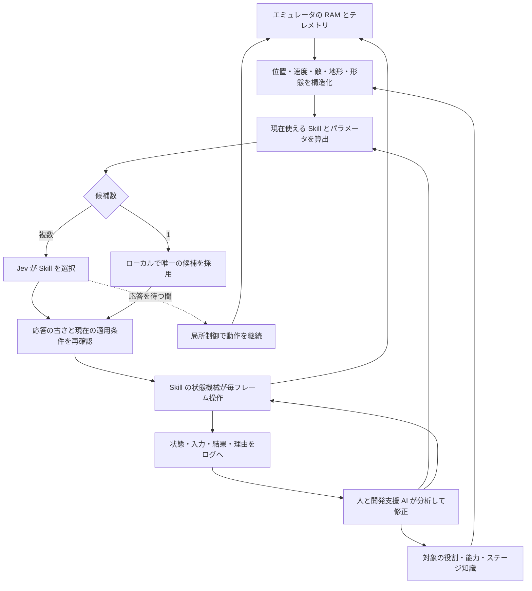
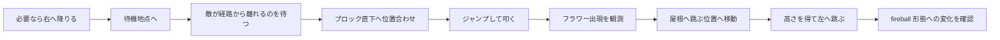

# マリオで実装したオントロジーと設計上の工夫

対象：共有リポジトリの `continuous-skills-v16`。記述基準日：2026-09-24。

この資料は、マリオを知らない読者でも「何を知識として持ち、何を判断し、どう動作へつないだか」を追えるように整理した設計解説です。実装履歴は [continuous-skill-runtime.md](continuous-skill-runtime.md)、ステージ知識の詳細は [mario-gimmick-knowledge.md](mario-gimmick-knowledge.md) にあります。

## 1. この実験でいうオントロジー

本実験では、オントロジーを **ゲーム内の対象・関係・状態に加え、行動の目的、適用条件、期待する結果、結果の確認方法を明示した知識体系** として扱います。

例えば「ジャンプ」というボタン入力だけでは、敵を避けたいのか、穴を越えたいのか、ブロックを叩きたいのかが分かりません。目的が異なれば、開始地点、横移動、ボタンを押し続ける時間、終了条件も変わります。その違いを名前と条件を持つ Skill にしたことが、今回の中心的な工夫です。

したがって、Skill の意味・条件も、この広い意味でのオントロジーに含まれます。一方、毎フレームどのボタンを入力するかというプログラムは、その知識を実行する機構です。説明のために層を分けますが、Skill をオントロジーの外に追い出すという意味ではありません。

実装は Python の辞書、dataclass、関数、状態機械です。RDF / OWL、トリプルストア、汎用の論理推論エンジンは使っていません。形式オントロジーによる証明ではなく、実行可能なドメインモデルとしての適用事例です。

## 2. 全体の情報の流れ



ゲーム実行中のモデル呼び出しは Jev への判断依頼です。Codex や Claude が毎フレーム画面を見て操作しているわけではありません。観測もスクリーンショット認識ではなく、エミュレータの RAM とテレメトリに基づきます。

ログを読んでコードを改善する開発作業と、プレイ中に動く制御ループは別です。現状、ログから自動的に学習済みモデルを更新する仕組みはありません。

## 3. どの情報をどこで管理するか

| 情報 | 内容 | 実装 | 変更する場面 |
|---|---|---|---|
| 対象の種類と役割 | 敵、アイテム、ゴール、未分類対象 | [knowledge.py](../src/typesafe_mario/knowledge.py) | 分類の誤りや対象追加 |
| 世界の規則 | ファイア条件、ジャンプ保持など | 同上 `RULES` | 規則の検証・認識方法の追加 |
| ステージの具体的な対象 | 1-1 の強化ブロック2か所 | [stage_knowledge.py](../src/typesafe_mario/stage_knowledge.py) | 別ステージ・対象追加 |
| 現在の観測 | 位置、速度、地形、敵、ブロック使用状態 | [state.py](../src/typesafe_mario/state.py) | 毎フレーム更新 |
| 関係と危険の推定 | 敵との接近、穴の距離、地形の信頼性 | `state.py`、`continuous_skills.py` | 推定精度の改善 |
| Skill の意味と適用条件 | 目的、対象、上限、パラメータ | [continuous_skills.py](../src/typesafe_mario/continuous_skills.py) | 新しい状況への対応 |
| 戦略 | 強化の寄り道を優先するか等 | [skill_policy.py](../src/typesafe_mario/skill_policy.py)、[knowledge_strategy.py](../src/typesafe_mario/knowledge_strategy.py) | 比較実験 |
| 実行 | 助走、離陸、入力保持、着地の確認 | SkillControl、個別制御クラス | タイミング・軌道の改善 |
| 実行基盤 | 非同期要求、応答再検証、入力源、記録 | [continuous_runner.py](../src/typesafe_mario/continuous_runner.py) | 停止・遅延・競合の改善 |

これは責務の整理です。現状、すべてが独立した設定ファイルに分離されているわけではありません。例えば `continuous_skills.py` には適用条件と制御が同居し、`knowledge.py` の定義には既定の対応方針も含まれます。戦略変更時には変更ファイルとソースハッシュを記録する必要があります。

## 4. 対象・関係・能力の定義

### 4.1 対象に役割を与える

`role(kind)` は、旗を `goal`、キノコやフラワーを `item`、既知の敵を `enemy`、それ以外を `unknown` に分類します。

| 役割 | 意味づけ | 判断への影響 |
|---|---|---|
| enemy | 接触するとダメージを受けうる | 回避・距離評価の対象 |
| item | プレイヤーに利益を与えうる | 安全な取得を検討 |
| goal | ステージ完了につながる | 接近する対象 |
| unknown | 未分類の動的対象 | 潜在的な危険として扱う |
| pipe | 固体の障害物 | 地形として通過方法を検討 |
| question_block | 下から叩けるブロック | 中身は観測なしに断定しない |

「画面内にいる動くものは全部敵」という扱いを避けるための区別です。ただし `DEFINITIONS` の文字列だけで制御が自動生成されるわけではありません。実際の行動条件はパーサや Skill の関数にも実装されています。

### 4.2 プレイヤーの能力は状態に依存する

`status` は `small`、`tall`、`fireball` を区別します。`can_fire` は `status == 'fireball'` で計算し、RAM から観測した `active_fireballs` とともに判断材料にします。

「フラワーの位置を知っている」「フラワーが出た」「取得して撃てる」は別の事実です。取得の確認には、対象が消えたことだけでなく、プレイヤーの形態変化を使います。

### 4.3 知識には出典と検証状態を持たせる

`RULES` は `id / subjects / condition / effect / source / validation / control_enabled` を持ちます。

- 攻略記事で読んだ内容と、RAM・実プレイで確認した内容を区別する。
- 甲羅の反射や踏みつけなど、記事由来の規則だけでは新しい制御を有効にしない。
- ファイア発射やジャンプ保持のように、制御に利用する規則を明示する。

`control_enabled` は知識のメタデータであり、全コントローラを一括で ON/OFF する汎用スイッチではありません。また、一部の `validation` 文言は過去の検証段階を残しています。最新の実験結果は履歴文書と突き合わせる必要があります。

## 5. 配置知識と現在の観測を分ける

登録対象は World 1-1 / area 1 の強化ブロック2か所です。

| ID | ワールド X | ブロックの画面 Y | 想定される内容 |
|---|---:|---:|---|
| `1-1-opening-upgrade` | 336 | 144 | small ならキノコ、tall / fireball ならフラワー |
| `1-1-second-upgrade` | 1248 | 144 | 同上 |

これは「その位置に取得可能なフラワーが今存在する」という主張ではありません。`observe_site()` が近傍の RAM を読んで、次の状態を付与します。

- `unused`：未使用ブロックを観測した。
- `used`：使用済みブロックを観測した。
- `unknown`：確認範囲だが期待するタイルと一致しない。
- `unobserved`：現在の確認範囲外。

近傍の確認範囲はブロックとマリオの X 差が −96〜128 px のときです。未使用はタイル `0xC1`、使用済みは `0xC4` として扱います。登録したステージ以外には適用しません。

この分離により「場所を知っているから必ず取りに行く」という判断を避け、未使用・プレイヤー形態・敵・足場を確認してから候補にできます。

## 6. 「ジャンプ」を意味のある Skill に分ける

`SkillSpec` の実際の構造は次のとおりです。

```python
@dataclass(frozen=True)
class SkillSpec:
    name: str
    max_frames: int
    expected: str
    parameters: dict = field(default_factory=dict)
```

Jev に渡す際は `expected_result`、`success_probability: None`、実験的な制御であることを示す `risk` を追加します。期待結果は目標であり、成功予測が保証されているという意味ではありません。現在、候補ごとの成功確率や数値リスクは計算していません。

### 6.1 Skill の一覧

| Skill | 意味・用途 | 実行上の特徴 |
|---|---|---|
| Advance | 安全な区間で前進 | 新しい危険が現れたら再判断 |
| Survey / WaitForOpening | 短い観察 / 制動待機 | 無入力でも慣性は残る |
| LandForward / ContinueJump | 空中から着地へつなぐ | 空中で不適切に前進を止めない |
| JumpOverEnemy | 前方の敵を越える | 敵の slot・kind・通過目標を持つ |
| EvadeRearEnemy | 後ろからの接近に対応 | 前方が安全なら前進、それ以外は跳躍を検討 |
| ApproachObstacle | 障害物の離陸地点へ近づく | 遠すぎる場所で待ち続けない |
| ClimbStep | 1段上の足場に着地する | 着地高さを目標に持つ |
| ClearObstacle | 障害物を越える | 障害物の形状に応じた制御 |
| RecoverObstacle | 詰まりから回復する | 後方の安全を確認し後退・再接近 |
| CrossStaircase | 階段とその先を通過する | 複数局面を一つの動作として扱う |
| EscapeValley | 谷間の高い壁から脱出する | 観測済みの床の範囲で助走 |
| ClimbThenCrossGap | 段上に着地してから穴を越える | 頂上で API 応答を待たず次の動作へ |
| CrossGap | 助走して穴を越える | 穴の端・対岸・離陸地点を持つ |
| CollectPowerup | 近くの観測済み強化アイテムを取る | 平坦な床・敵・形態を確認 |
| VisitOpeningPowerup | 登録した序盤ブロックを訪問する | 叩く→出現確認→取得確認 |
| VisitFlower | 2か所目のフラワーを取りに行く | 敵待ち・位置調整・ブロックへの跳躍 |
| FireAtEnemy | 距離を保って発射する | B の押し直し・弾数・接近時の回避 |

すべての Skill が常に候補になるわけではありません。`catalog(snapshot)` が現在の条件を満たすものだけを返します。成功・失敗判定の細かさは Skill ごとに異なり、すべての期待結果を完全に照合できるわけではありません。

### 6.2 穴越えの具体例

`CrossGap` は、穴までの距離が4タイル以内で `gap_crossing_outlook == 'clearable'` のときなどに候補になります。パラメータはコードが地形から生成します。

```python
{
    'gap_start_x': edge,
    'gap_end_x': far,
    'takeoff_x': edge - 16,
    'target_x': far + 8,
    'jump_hold_frames': 30,
}
```

Jev が自由に離陸位置や保持時間を発明しているわけではありません。コードが条件とパラメータを具体化し、Jev は候補を選びます。制御は最新の状態を読みながら助走・離陸・着地を進めます。

16 px は1タイルです。これらの値は対象ステージで調整した経験的パラメータであり、別のゲーム速度・物理・ステージへの普遍的な最適値ではありません。

### 6.3 「二段目から穴へ落ちる」への対応

段差を上がるジャンプと穴を越えるジャンプを一つの曖昧な入力で済ませると、十分な高さ・助走を得る前に穴へ出てしまいます。

`ClimbThenCrossGap` は「まず頂上に着地する」「その後に穴越えへ移る」を一つの複合 Skill にします。これは単にジャンプを長押しにする修正ではなく、成功に必要な中間状態を知識として明示した例です。

## 7. Jev に何を渡し、何を任せるか

`TypeSafeSkillPolicy.choose_skill()` は構造化した状態に次を付け加えます。

- 後方からの接近情報 `rear_threat`
- 戦略の版 `knowledge_strategy_version`
- 実行可能候補 `skill_candidates`
- 最近の Skill 結果 `recent_skill_outcomes`

状態側にはプレイヤー・地形・敵・進捗・世界知識などが入ります。`Choice` の選択肢には Skill 名と `SkillSpec.to_state()` を渡します。

判断指示は、ゴール到達と生存、未観測のアイテムを仮定しないこと、候補にある安全な強化の寄り道、待機の繰り返しを避けることなどです。フラワーについては、現在の実験では通常前進より優先し、差し迫った敵の回避は優先する方針です。

| コード側が決める | Jev が決める |
|---|---|
| 何が観測されたか | 複数の候補からどれを採用するか |
| 現在どの Skill が使えるか | 状況と最近の結果を踏まえた候補の選択 |
| Skill の対象・離陸地点・入力時間 | 候補に対する選択結果・モデル出力の確信度 |
| 応答が今も適用できるか | — |
| 毎フレームの操作と緊急引き継ぎ | — |

唯一の候補しかない場合は API を呼ばずローカルで採用します。ログは `local_single_candidate`、確信度0、確率分布空として記録し、モデルが判断したようには扱いません。モデルの確信度も、実際のゲームで校正済みの成功率とは異なります。

## 8. 応答待ちで「目隠し走行」にならない工夫

モデルの応答が返るまでゲームが進むため、要求時点の正しい判断が到着時点では遅すぎることがあります。そこで次を組み合わせました。

1. **要求を非同期にする。** ゲームは止めず、要求は一つずつ処理します。
2. **待ち時間を局所制御が担当する。** `AwaitDecision` が現状を見て動作を継続します。
3. **到着後に再検証する。** 45フレームを超えた応答、対象が変わった応答、適用条件を失った応答は採用しません。
4. **進行中の安全動作を途中で壊さない。** 引き継ぎや着地保護が動作を継続中なら、返ってきた選択を優先しません。
5. **入力源をログに残す。** Jev、局所引き継ぎ、回復、着地保護を区別します。

対象確認には敵の slot / kind や穴の開始・終了位置などを使います。ただし slot はゲーム内部で再利用されうるため、長期に不変な個体 ID ではありません。

この制御はフィードバックを受ける決定論的なプログラムです。「同じ Skill 名なら必ず同じ結果になる」という意味ではありません。ゲーム状態、API 応答のタイミング、観測範囲に結果が左右されます。

## 9. 停止・落下・接触から得た具体的な工夫

| 症状 | 見直した知識・条件・制御 | 設計上の学び |
|---|---|---|
| 土管の手前で同じ操作を続ける | 進捗監視、接近、障害物越え、回復 | 生存だけでなく進捗を評価する |
| 穴が4タイル先にあると待機する | 前進を止める条件と CrossGap の適用範囲を接続 | どの行動も使えない条件の隙間をなくす |
| 高い足場を穴と誤認する | 下方向の地形観測を拡張 | 見えない床を「ない床」と断定しない |
| 頂上前のジャンプから穴へ落ちる | ClimbThenCrossGap | 必要な中間着地を明示する |
| 着地先の敵に触れる | [landing.py](../src/typesafe_mario/landing.py) の着地保護 | 現在の接触だけでなく実行後の位置を考える |
| 待機中に後ろから敵が来る | 後方の接近速度と EvadeRearEnemy | 危険を進行方向だけに限定しない |
| フラワーが取れず通過する | 早めの候補化、敵待ち、段階的な取得 | 場所の知識だけで取得は成立しない |
| 候補が一つで API 要求が失敗する | ローカルの単一候補選択 | モデルが必要な判断と不要な判断を分ける |

進捗停滞時は前進系候補があれば Survey / WaitForOpening を外し、条件が合う回復候補を局所実行します。ただし「どんな詰まりでも解消する」という保証はありません。また通信エラー時には `request_error` を記録して終了し、無条件の自動リトライは行いません。

## 10. フラワー取得は「知識を行動へつなぐ」例

### 10.1 候補にする条件

`flower_eligible()` は tall、接地中、X が1176〜1344、2か所目が未使用と観測済み、近距離の同じ高さの敵がいない、下の地面が見えていることなどを要求します。座標と高さの条件はこのステージ向けです。

### 10.2 状態機械



経路の床を再確認し、敵が近づいた場合は中断します。550フレームの上限、対象区間外への移動、強化状態喪失なども終了条件です。同じ登録地点への試行は、同一プレイ中に繰り返さないよう管理します。

これにより「取得したはず」を避けます。フラワーが見えなくなっただけでは成功にせず、`fire_form_confirmed` で確認します。

### 10.3 ファイアで敵を処理する

`FireAtEnemy` は fireball 形態で、平坦な床に立ち、速度が小さく、遠方の対応する敵がいる場合に候補になります。

- 最初に右を向き、前の B 入力を解除する。
- 12フレーム周期で B を押し直す。
- 観測済みの弾が2発未満のときに発射する。
- 敵が近づいたら回避へ判断を返す。
- 対象が消えても `target_no_longer_observed_not_confirmed_kill` とし、撃破を断定しない。

発射能力、入力の押し直し、弾数制約、危険距離、成功の証拠を一続きにした点が重要です。なお、通常の走行操作にも B が含まれるため、`FireAtEnemy` を無効化しても全ファイア入力がなくなるわけではありません。

## 11. ログでどこまで原因を切り分けられるか

| イベント | 主な記録 | 確認できること |
|---|---|---|
| run_start | 版、seed、設定、Pythonソースのハッシュ | どの条件で動かしたか |
| request | 状態、候補、最近の結果 | 判断時に何が見えていたか |
| response | 選択、経過フレーム、遅延、接続経路、確率 | 何が選ばれ、何フレーム古かったか |
| response_rejected | 期限切れ・条件変化等の理由 | 選択がなぜ使われなかったか |
| skill_started / skill_result | 対象、状態、結果、理由 | どの Skill がどこまで進んだか |
| controller_frame | 入力源、phase、入力、前後の状態 | 実際に何を操作したか |
| landing_safety / stall_detected | 介入と停滞の状態 | 局所制御が必要だった事情 |
| request_error / episode_end | エラー種別、終了理由、最大X等 | 接続失敗・死亡・手動終了を区別 |

分析例：穴の位置が間違っていれば観測・関係推定を、正しい穴越え候補がなければ適用条件を、候補があるのに待ち続ければ選択方針を、正しい候補でも飛距離が足りなければ制御を確認します。

ただし、ログだけで「別の行動なら必ず成功した」と証明できるわけではありません。入力の再生や同条件の比較を補助に使います。例外の本文・ヘッダーを保存せず、種類を残すなど、秘密情報を記録しない工夫もあります。

## 12. 固定するものと、変えて検証するもの

| 比較の対象 | できるだけ固定するもの | 変えるもの | 見る指標 |
|---|---|---|---|
| 強化の寄り道 | ステージ、初期状態、制御版 | 序盤取得・フラワー訪問の ON/OFF | 取得率、クリア率、所要フレーム |
| ファイア Skill | アイテム取得方針、他の Skill | 意図的な射撃 Skill の ON/OFF | 接触死、介入回数、完走率 |
| 判断方針 | 観測と候補生成、制御 | Jev への優先順位 | 選択傾向、停滞、完走率 |
| 制御改善 | 同じ場面・同じ対象 | 離陸位置、保持時間、状態遷移 | 通過・着地・接触の成否 |
| 観測改善 | 同じ局面 | 地形の範囲や認識処理 | 誤分類、候補の欠落 |

既存フラグは `--skip-opening-powerup`、`--skip-flower-visit`、`--skip-fire-skill` です。これらはオントロジー全体を無効化するフラグではありません。

元リポジトリ版にも構造化した状況と判断規則があります。その比較は「知識なし対知識あり」ではなく、「今回の意味づけ・Skill・観測・制御の拡張前後」です。表示方式によって時間進行も異なるため、条件を揃えます。途中再開や手動中断は完走試行と分けて記録します。

## 13. 得られた結論と残る課題

今回の事例では、曖昧な操作を、目的・適用条件・中間状態・結果確認を持つ Skill に具体化し、局所制御につなぐことで、繰り返し問題になった場面へ対処できるようになりました。ユーザーの実行でも、クリアが安定してきたことが確認されています。

これは **オントロジー的な知識を実行可能な判断条件として使う、具体的な適用事例** です。ただし同時に観測・タイミング・制御を改善しているため、クリア率向上をオントロジー単独の効果として数値化したものではありません。

残る課題は、条件を固定した通し試行、Skill ごとの成功率の校正、知識と戦略と制御のより明確な分離、別ステージへの一般化です。配置を知っていること、使える行動があること、実際に成功することを分けて扱う姿勢を、今後の比較でも維持します。

業務に置き換えるなら「対象と状態を定義する → 実行可能な業務行動を絞る → 選択する → APIやスクリプトで実行する → 結果を確認する」という構成です。重要なのは用語を列挙するだけでなく、判断と実行をつなぐ条件まで明示した点にあります。

## 14. なぜ Skill に kinetics の制御上の意味まで含めるのか

### 14.1 判断と判断の間にも世界は変わる

「敵を跳び越える」と判断した瞬間と、実際に入力が始まる瞬間では、マリオと敵の位置・速度が変わっています。実行中にも、上昇、頂点、下降、着地へと状態が変化します。

ここでいう kinetics は、速度・慣性・ジャンプ軌道と、それを操作する制御を指しています。物理法則がランダムに変わるという意味ではなく、時間経過により判断の前提が古くなること、同じボタンでも初期位置・速度・接地状態によって結果が違うことが問題です。

例えば60フレーム/秒で動作するなら、300msの待ち時間は約18フレームです。説明用に毎フレーム2pxで進むと仮定すれば、その間に36px、約2タイル移動します。この数字は実測結果ではありませんが、「判断時には十分遠かった穴が、入力開始時には目前」という時間差を表します。

### 14.2 Skill は、次の判断まで意味を保って動くための約束

Skill はボタン列の名前だけではありません。概念的には、次の情報を結び付けた行動単位です。

| 判断軸 | 問い | 穴越えの場合 |
|---|---|---|
| 目的 | 何を達成したいか | 対岸に着地する |
| 適用条件 | 今その行動を開始できるか | 接地していて、穴の形状を把握できる |
| 対象 | 何に対して実行するか | 特定の開始位置・終了位置を持つ穴 |
| パラメータ | どこで、どれくらい操作するか | 離陸位置、着地目標、ジャンプ保持時間 |
| 継続条件 | 途中で何を維持するか | 穴の上で前進と必要な跳躍を継続する |
| 中断条件 | どの変化で前提が崩れたか | 離陸前に足場を失う、穴の端を通り過ぎる |
| 終了の証拠 | 何を見て完了とするか | 目標位置を越え、接地を確認する |
| 再判断の境界 | いつ Jev に判断を返すか | 着地・失敗・中断・時間上限など |

この全項目が `SkillSpec` のフィールドになっているわけではありません。目的・上限・パラメータは `SkillSpec`、適用条件は `catalog()`、継続・中断・終了条件はコントローラに分かれて実装されています。それらを合わせて Skill の意味を実行へつなげています。

毎回「右か、ジャンプか、待つか」を独立に選ぶ方式では、穴越えの途中で前進を止めるなど、前の判断の目的を壊す可能性があります。Skill は「まだ同じ穴越えを実行中である」という文脈を保持します。一方、危険が変われば中断や安全制御へ移るので、最後まで盲目的にボタンを押す仕組みでもありません。

### 14.3 具体例A：穴を越える判断がどう変わるか

**ボタン中心の問い：**「今、ジャンプを押すべきか？」

**Skill 中心の問い：**「この穴を越える条件が成立しているか。今は接近・離陸・空中維持・着地のどの段階か。別の行動へ切り替えてよいか？」

説明用に、穴の始まりを X=1104、対岸を X=1136 とすると、現在の実装は `takeoff_x=1088`、`target_x=1144`、`jump_hold_frames=30` を生成します。この座標は説明例であり、特定の成功ログを再現したものではありません。

1. Jev は適用可能な `CrossGap` を選ぶ。
2. 応答時に穴の位置と適用条件を再確認する。
3. ローカル制御が X=1088 まで助走する。離陸は API の返答時刻ではなく現在位置で判断する。
4. ジャンプ入力を一度解除する必要も確認し、新しいジャンプを開始する。
5. 最大30フレームの跳躍保持を行い、その後も前進して着地へつなぐ。
6. 結果を確認して次の判断へ戻る。離陸前に足場を失った場合などは失敗・中断として扱う。

つまり Jev の判断軸は「次のボタン」から「どの目的を持った行動に委ねるか」へ変わり、制御側の判断軸は「経過時間だけ」から「その行動の段階と観測状態」へ変わります。なお、この実装の保持時間は経験的な固定値で、毎フレーム最適軌道を再計算する物理シミュレータではありません。

### 14.4 具体例B：段差の先に穴がある場合

同じ前方ジャンプでも、段差の途中から直接跳ぶと穴の手前で十分な高度・助走が得られないことがあります。

`ClimbThenCrossGap` によって、判断軸に **「頂上への着地が済んでいるか」** が加わります。まず段に上がる制御を実行し、成功を確認してから穴越えへ移ります。この切り替えでは Jev の新しい応答を待ちません。

ここでは「頂上に着地する」という中間状態を定義したことと、その状態で次の制御へ進めることが一体になっています。これは行動の意味づけが、実行タイミングの安定化にも寄与する具体例です。

### 14.5 具体例C：待機と後方の敵

「何もしない」は常に安全な動作ではありません。慣性で進むことも、待っている間に後ろから敵が追いつくこともあります。

この状況では、判断軸に **後方の距離・相対速度・高さ・前方の退避可能性** を加えます。Jev の応答待ち中でも `AwaitDecision` が後方接近を検出し、`RearEvade` へ引き継ぎます。

この回避を始めた後に、古い状況を見た Jev の応答が届いても、実行中の回避を無条件に上書きしません。ここで重要なのは「待つか進むか」だけでなく、「今すでに完了まで維持すべき動作に入っているか」という判断軸です。

### 14.6 具体例D：フラワーを取りに行く判断

フラワーの位置が分かっていても、「取得へ向かう」を即座に入力へ変換すると、敵や穴への接近につながります。

`VisitFlower` では、判断軸を次のように具体化しています。

- **利益があるか：** 現在 tall で、fireball 形態への強化を狙えるか。
- **対象が有効か：** 登録地点が現在も未使用と観測されているか。
- **今すぐ行けるか：** 敵と高さ・距離が危険な関係にないか。
- **待てる場所があるか：** 待機地点まで床がつながっているか。
- **次の段階へ進めるか：** 敵が経路を離れたか、位置合わせが済んだか、フラワーが出たか。
- **目的を達成したか：** fireball 形態に変わったか。

「取得の価値」と「今の経路の安全性」を分け、取得を選んだ後も条件を観測し続けます。これが、配置知識だけを持つ場合との違いです。

### 14.7 効果の捉え方

今回の Skill 定義は、判断に必要な意味を増やすと同時に、判断と判断の間を埋める制御の単位を作っています。そのため、広い意味ではオントロジーの適用が実行の安定化へつながった事例と捉えられます。

ただし、Skill を定義するだけで自動的に安定するわけではありません。観測、適用条件、パラメータ、実行中の確認、応答の再検証が揃って初めて機能します。今後は「候補の選択を変える効果」と「同じ候補を正確に実行できるようにする効果」を分けて測定すると、改善の理由をさらに明確にできます。
