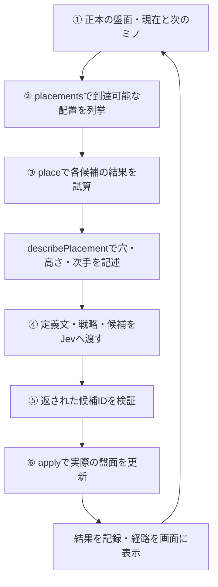

# テトリス：意味と結果を対応付けやすい事例

更新日：2026年9月26日。[全体比較](01-overview.md)／[マリオ](03-mario.md)／[スイカ](04-suika.md)

## 見解

**セマンティックを設定しやすく、kineticsがこの実装では決定論的に計算できるため、オントロジーを判断と実行へつなげやすい事例である。** 記録された継続実行の区間では、一度もゲームオーバーが記録されなかった。

ここで「効きやすい」とは、定義した判断知を候補生成・選択・実行・結果確認へ一貫して適用しやすいという意味である。知識追加だけによる得点向上の大きさを測定したという意味ではない。

## 対象と仕組み

自作の10×20盤面、7種類のミノを持つターン制デモ。ホールド、リアルタイム重力、正式SRS、ロックディレイを省略している。一般の競技テトリス全体への結論ではない。

正本盤面 → 到達可能な配置の列挙 → 配置後の消去・穴・高さ・次手の計算 → Jevによる選択 → 同じエンジンで配置を適用、という構成。判断待ちにゲームは進まない。移動・回転の表示と、API待ちの時間的な問題を分離している。

## セマンティックとkinetics

**セマンティック**は、セル・ミノ・占有・穴・到達可能な配置などの意味と、それらの関係を定義する部分である。「穴が3個」という状態だけでなく、「この配置で穴が2個増える」という行動前後の関係も判断知になる。

**kinetics**は、選んだ配置へミノを動かし、固定し、行を消去して次の盤面へ遷移する部分である。このデモでは到達可能な配置を列挙し、選択した配置をエンジンで適用する。判断待ちには落下が進まないため、APIの応答時間によって選んだ位置へ置けなくなる問題を避けている。

両者は、候補ごとの「配置後の盤面」を介してつながる。候補評価に使ったルールと実際の配置に使うルールが同じなので、意味として定義した穴・消去・高さを、実行結果でも同じ方法で確認できる。

## どの情報が判断知か

**今回はRDF／OWLで定義していない。** JavaScriptの配列・オブジェクトで対象と状態を保持し、関数で関係と状態遷移を計算し、定義文と戦略文をJevへ渡している。独立したオントロジーファイルや汎用推論エンジンではなく、意味の定義をプログラムと入力データに明示した構成である。

| 区分 | 具体例 | コードでの表現 | セマンティック／kineticsとの関係 |
|---|---|---|---|
| 対象・属性 | セル、ミノ、向き、占有、列 | `board[y][x]`、`SHAPES[type][r]` | セマンティックの対象・属性を配列とキーで表現 |
| 関係 | 衝突、到達可能、被覆、隣接 | `fits()`、`placements()`、`buried()` | セマンティックの関係を判定・探索する |
| 指標 | 穴の増減、高さ、天井余裕、消去数 | `describePlacement()`、`DEFINITIONS` | kineticsの結果を意味のある指標へ変換 |
| 戦略 | 次手の行き詰まり回避、穴を抑える | `instructions`の文章と`criteria`の候補 | 意味づけされた候補に優先方針を与える |
| 達成条件・結果 | 合法な配置の成立、ライン消去、生存 | `place()`の結果、`apply()`の`over` | kineticsの実行結果を確認する。独立したSkill成功判定器はない |

## 一手を決めるまでの判断フローとコード

[マリオの設計資料「全体の情報の流れ」](../mario-ontology-and-design.md#2-全体の情報の流れ)と同様に、情報がどの順番で判断と実行へ渡るかを示す。前の表が「何を表現しているか」、以下が「それをいつ、どう使うか」に対応する。



①②は主に対象・関係というセマンティックを扱う。③ではkineticsのルールで結果を試算し、それを意味のある指標へ変換する。④⑤で一手を選び、⑥で実際にkineticsの状態遷移を適用する。以下は実コードの抜粋・省略例で、説明用の数値は別途明記する。

### ① サーバーが持つ現在の状態を読む

盤面はスクリーンショットから推測せず、`game`が持つ正本を使う。

```js
// server.mjsで参照する情報
// game.board     : 現在の盤面
// game.queue[0]  : 今回置くミノ
// game.queue[1]  : 次のミノ
```

盤面の生成はengine.mjs（ローカル検証資料：`typesafe-mario/tetris/public/engine.mjs`）に定義されている。

```js
export const W = 10, H = 20;
export const emptyBoard = () =>
  Array.from({length: H}, () => Array(W).fill(0));
```

`board[y][x]`の`0`は空きセル、配置後の`"T"`などは占有しているミノ種類を表す。対象と属性の意味を、RDFではなく配列・値・キーの規約で表現している。

### ② 到達可能な置き場所を候補にする

server.mjs（ローカル検証資料：`typesafe-mario/tetris/server.mjs`）の一手処理は、まず候補を生成する。

```js
const candidates = placements(game.board, game.queue[0]);
```

`placements()`は移動・回転を探索し、合法な着地位置とそこまでの`path`を返す。内部では次の`fits()`を使う。

```js
export function fits(board, type, r, x, y) {
  return cells(type, r, x, y).every(([cx, cy]) =>
    cx >= 0 && cx < W && cy >= 0 && cy < H && !board[cy][cx]);
}
```

これは「全セルが盤面内にあり、占有セルと重ならない」という関係の定義である。各候補は`id`・位置`x,y`・向き`r`・経路`path`などを持つ。この時点では、どの候補を選ぶかをJevはまだ判断していない。候補がなければゲーム終了として扱う。

### ③ 各候補を置くと何が起きるかを計算する

`decideWithJev()`が、現在の指標と次のミノを用意し、候補を説明する。

```js
const current = metrics(game.board);
const nextType = game.queue[1] ?? null;
const describe = p => describePlacement({
  board: game.board,
  type: game.queue[0],
  candidate: p,
  current,
  nextType
});
const described = Object.fromEntries(
  candidates.map(p => [p.id, describe(p)])
);
```

knowledge.mjs（ローカル検証資料：`typesafe-mario/tetris/knowledge.mjs`）の`describePlacement()`は、候補を仮に置いた盤面を計算する。

```js
const after = place(board, type, candidate);
const stats = metrics(after.board);
const cover = buried(after.board);
```

ここでの`place()`は試算で、正本の`game.board`は変更しない。配置・行消去というkineticsを計算した後、結果を次のような意味のある値にする（戻り値の抜粋）。

```js
holesAdded: stats.holes - current.holes,
heightChange: stats.maxHeight - current.maxHeight,
ceilingMargin: ROWS - stats.maxHeight,
```

例えば`holesAdded: 2`は「その候補を選ぶと穴が2個増える」という意味になる（数値は説明用）。`lookahead()`では、その候補の後に次のミノが置けるかも試算する。次手指標の組み合わせには、後述する注意点が残る。

### ④ 状態・意味の定義・候補・戦略をJevへ渡す

`route.call()`に渡す構造を、長い戦略文を省略して示す。

```js
const result = await route.call(
  {
    board: game.board.map(row => row.map(v => v ? '#' : '.').join('')),
    boardLegend: 'Top row first, # occupied, . empty; 10 columns, 20 rows.',
    piece: game.queue[0],
    nextPieces: game.queue.slice(1, 4),
    current,
    fieldMeanings: DEFINITIONS
  },
  {
    placement: {
      type: 'choice',
      instructions: 'Choose the best reachable placement for this tetromino. Survive first, then clear lines.',
      // 実際には穴・井戸・次手などの優先方針が続く
      criteria: described
    }
  }
);
```

`DEFINITIONS`には、例えば次の定義文がある。

```js
heightChange: 'Change in the tallest column. Negative is a lower stack.',
```

つまり、Jevには単なる数値だけでなく、「何の数値か」と「何を優先するか」を一緒に渡す。候補とその結果はコードが計算し、Jevは候補IDを選ぶ。対象・関係・指標・戦略という前の表の情報が、ここで一つの判断へ集約される。

### ⑤ Jevが選んだ候補IDを元の候補に対応付ける

一手処理側の抜粋：

```js
const answer = await decide(game, candidates);
const selected = candidates.find(p => p.id === answer.id);
if (!selected) throw new Error('Invalid model choice');
```

標準の`decide`は`decideWithJev()`であり、`result.answers.placement.choice`を`id`として返す。Jevが新たな座標や動作を自由に生成するのではなく、②で列挙した到達可能な候補の一つとして検証する。**ここまでで今回の一手が決まる。**

### ⑥ 選んだ一手を実行し、結果を次の判断へ戻す

```js
game = apply(game, selected);
```

`apply()`は内部で`place()`を使い、正本盤面・得点・次のミノを更新する。次のミノが出現位置に置けるかで、ゲームオーバーも判定する。

```js
const over = !fits(result.board, queue[0], 0, 3, 0);
```

③の試算と⑥の実行で同じ配置ルールを使うため、一手の結果を対応付けられる。サーバーは実行結果を記録し、ブラウザは返された`selected.path`を使って移動・回転を表示する。このデモでは、画面アニメーションの成功を待って物理結果が決まるわけではない。

更新された盤面が次の①になる。各段階の意味はJavaScriptのデータ・関数・定義文で表現されており、RDF／OWLの推論器を通しているわけではない。

## 記録で確認したこと

**記録された一定期間の継続実行では、一度もゲームオーバーが記録されなかった。** 監査対象の3つのログ群は全て最終状態が`over:false`で、最も長いものは404判断・155行消去まで継続している。経過時間を今回確定していないため、「何時間でも続く」「永久にゲームオーバーにならない」とは表現しない。

補助的な確認として、9月23日の監査では計509判断を再計算し、記録されたライン消去数・穴数が全件一致した。これはセマンティックに定義した指標と、kineticsの結果を対応付けやすいことを裏付ける。

各ログは異なる長さの途中経過であり、知識追加前後の得点比較としては扱わない。詳しい集計は監査結果（ローカル検証資料：`web-player/docs/evidence/tetris-audit.json`）に残している。

## うまくいかなかった知識表現

次手の最大消去行数と最小穴数を別々に計算していた。102手のうち6手では、その両方を同時に達成する次手が存在しなかった。

それぞれの値が正しくても、「同じ行動で両方を達成できる」という関係まで正しいとは限らない。指標を一つの次候補に紐付ける必要がある。また「深い井戸はIミノでしか埋められない」等の説明は、一般則ではなく戦略上の近似として扱う必要がある。

## 学び

**セマンティックを設定しやすく、kineticsが決定論的に計算できることが、このテトリス実装でオントロジーを適用しやすかった主な理由と考えられる。**

セマンティックではセル・占有・穴・消去といった意味を明確なデータ構造と関数にできる。kineticsでは、同じ盤面・現在のミノ・選択配置なら、配置と消去後の盤面が同じになる。そのため、判断に使う意味と実際の結果のずれを検証し、知識表現の誤りも発見しやすい。

将来のミノ生成には乱数があるため、ゲーム全体が完全に既知という意味ではない。決定論的なのは、ここで評価する一手の配置・消去の状態遷移である。また、ターン制で判断中に盤面を止める実装条件も有利に働いている。

スイカのように投入後の衝突が多数の対象へ波及する場合と比べて、成功・制約を表す指標を計算しやすい。マリオのように実行中の状態へ追従し続ける制御も、このデモでは必要としない。こうした条件により判断知を実行へ接続しやすく、観測した範囲ではゲームオーバーのない継続プレイにつながった。ただし、オントロジーの寄与の大きさを単独で測定した結果ではない。

## 根拠と実装

- 既存の比較レポート（ローカル検証資料：`web-player/docs/suika-tetris-ontology-comparison.md`）
- 509判断の監査結果（ローカル検証資料：`web-player/docs/evidence/tetris-audit.json`）
- 監査スクリプト（ローカル検証資料：`web-player/docs/evidence/audit-tetris.mjs`）
- 関係と指標（ローカル検証資料：`typesafe-mario/tetris/knowledge.mjs`）
- 候補選択と実行（ローカル検証資料：`typesafe-mario/tetris/server.mjs`）、エンジン（ローカル検証資料：`typesafe-mario/tetris/public/engine.mjs`）

既存READMEにはVercel経由との記述があるが、監査ログは直接API経由で、現在のサーバーも直接キーがあればそちらを優先する。通信経路の違いをゲームや知識表現の効果と混同しない。
