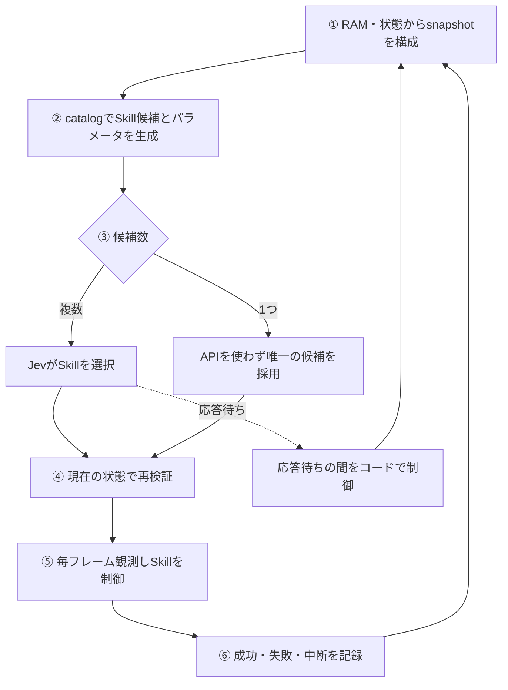

# マリオ：行動の意味を継続制御へ接続した事例

更新日：2026年9月26日。[全体比較](01-overview.md)／[テトリス](02-tetris.md)／[スイカ](04-suika.md)

## 見解と対象の限定

本資料の検証済み結果は、Codex側のcontinuous-skills-v16、SuperMarioBros-1-1-v0を対象とする。曖昧なジャンプを、目的・対象・適用・継続・成功・中断条件を持つSkillへ分け、実行時の観測と結びつけることでクリアする構成へ改善できた。

**行動の意味を認識・候補生成・制御へ反映した改善であり、オントロジーの適用が大きく寄与したと考える根拠がある。** これらを無関係な別要因として切り離すのではなく、判断知が実行を方向づけた成果と捉える。ただし、寄与の大きさを厳密に数値化した比較実験ではない。

## 何が足りなかったか

「敵や穴があるのでジャンプする」という高レベル判断だけでは、踏切位置、ボタン保持時間、横入力、着地点が決まらない。応答待ちにもゲームが進み、判断時と実行時の状態がずれる。ジャンプ自体ができても、次の穴へ落ちる、壁で止まる、待機中に敵が近づく問題があった。

## セマンティックとkinetics

セマンティックは、敵・穴・足場・アイテムといった対象、その位置や役割の関係、行動の目的と適用・成功条件を定義する部分である。kineticsは、速度・慣性・ジャンプ・着地など、判断後に時間をかけて進む動きとその制御である。

同じ「ジャンプ」でも、敵を越える、穴を越える、上の段へ乗るでは目指す状態が違う。目的と成功基準を分けてSkill化することで、踏切、入力の継続、着地、次の行動への切り替えまで意味を持たせた。**セマンティックな目的を、kineticsの途中でも維持する仕組み**が、この事例の中心である。

RDF／OWLで記述した実装ではない。Pythonの辞書・データクラス・条件判定・状態機械によって判断知を表現する。Skill名だけがオントロジーなのではなく、関連する対象、適用条件、継続・中断・終了の定義を合わせて行動の意味を構成する。

## どの情報が判断知か

| 区分 | 内容 | コード上の表現 | 実行との関係 |
|---|---|---|---|
| 対象・属性 | 敵、地形、形態、速度、アイテム | `MarioSnapshot`、`knowledge.py` | 観測を意味のある対象として扱う |
| 関係・配置 | 敵との距離、穴の端、足場、登録ブロック | `state.py`、`stage_knowledge.py` | 今使える行動の条件になる |
| 行動の目的・期待結果 | 対岸着地、敵越え、取得 | `SkillSpec`の`name`・`expected`・`parameters` | 何を達成するための操作かを保持する |
| 適用条件 | 接地、地形、敵、対象の状態 | `catalog()`と補助関数 | 実行可能な候補を絞る |
| 選択方針 | 生存・前進、危険時の回避 | `TypeSafeSkillPolicy.choose_skill()` | Jevに候補と判断知を渡す |
| kineticsの継続・終了 | 助走、踏切、入力保持、着地、中断 | `SkillControl`と個別制御クラス | 観測に応じて入力と行動段階を更新する |
| 時間と再検証 | 応答の古さ、実行時の適用条件 | `continuous_runner.py`、`response_valid()` | 古くなった判断をそのまま実行しない |

## 一手を選び、目的を達成するまでのフロー



### ① 状態を観測する

画像だけでなく、エミュレータのRAMと状態を使い、位置・速度・接地・敵・地形を構造化する。観測の正確さは有利な前提であり、画像だけで操作するスイカとは異なる。

### ② 状態に適用できるSkillを作る

`catalog(s)`が条件を確認し、`SkillSpec`を返す。以下は公開用コードの抜粋である。

```python
@dataclass(frozen=True)
class SkillSpec:
    name: str
    max_frames: int
    expected: str
    parameters: dict = field(default_factory=dict)
```

穴越え候補を作る部分（共通条件は省略）：

```python
distance = nav.get('gap_distance_tiles')
if not climb_gap and distance is not None and distance <= 4 and nav.get('gap_crossing_outlook') == 'clearable':
    edge = (s.x // 16 + distance) * 16
    far = edge + nav['gap_width_tiles_visible'] * 16
    choices.append(SkillSpec(
        'CrossGap', 120,
        'run up, take off before the edge, and land beyond it',
        {'gap_start_x': edge, 'gap_end_x': far,
         'takeoff_x': edge - 16, 'target_x': far + 8,
         'jump_hold_frames': 30}))
```

対象の穴と、踏切・着地の目標をセットで候補にする。「右ジャンプ」というボタン列だけを渡すのではない。数値はこの実装の経験的な設定であり、普遍的な法則や最適値ではない。

### ③ 候補を選ぶ

`choose_skill(snapshot, candidates, feedback)`は複数候補ならJevへ状態・知識・期待結果・最近の結果を渡す。候補が1つならAPIを使わずコードで採用し、`route='local_single_candidate'`として区別する。この候補選択をJevの判断と数えない。

### ④ 応答を現在の状態に照らす

選択中もゲームは進む。応答の古さや最新の適用条件を確認し、前提を失ったSkillは無条件に開始しない。v16では45フレーム以内という応答条件や、対象照合・着地保護との調整がある。候補が1つでAPIを使わない場合も条件確認は必要になる。

### ⑤ Skillの目的に向けて継続制御する

説明例として穴がX=1104〜1136なら、上の式は踏切1088、着地目標1144、ジャンプ保持30フレームを生成する。実測ログの座標ではなく、コードの読み方を示す例である。

制御は接近・離陸・空中維持・着地という段階を持ち、現在位置と状態で入力を決める。踏切はAPIが返った瞬間ではなく、踏切位置に達したかで判断する。途中で危険や前提の変化があれば中断・安全制御へ移る。毎フレームの入力はコードが担当し、Jevや開発支援AIが毎フレームキーを選ぶわけではない。

#### 例：穴を越えるまで、同じSkillの目的を維持する

`CrossGap`を選ぶのは「ジャンプボタンを押すため」ではなく「対岸へ着地するため」である。踏切まで進む → ジャンプする → 空中でも右入力を続ける → 対岸への着地を確認する、という一連の動きを同じSkillとして扱う。空中の右入力を毎回Jevに選び直してもらうのではなく、現在の段階と観測に応じてコードが操作を継続する。

本書でいう**「Skillの目的を達成するまでの継続制御」**とは、このことを指す。なお、Jevから次の選択が返るまでの間をつなぐ制御や着地保護もコードで行うが、それらは選択済みSkillの継続制御と役割を区別する。

#### 例：キノコを取りに行くが、敵が近づいたら中断する

序盤の`VisitOpeningPowerup`は、小さいマリオを強化することが目的である。登録ブロックの下へ位置を合わせ、叩いてアイテムを出し、取得へ進む。ただし、**目的があるからといって、達成するまで無条件に追い続けるわけではない。**

| 条件 | そのSkillの扱い |
|---|---|
| 取得前で、周囲の安全条件が保たれている | 位置合わせ・ブロック打撃・取得へ向けた操作を続ける |
| 大きい状態またはファイア状態への変化を確認 | 強化取得の成功として終了する |
| 取得前に近くの敵が危険範囲へ入る | 取得行動を中断し、以後の判断・制御へ戻す |
| 死亡や試行時間の上限 | 失敗として終了する |

[powerup_site.py](../../src/typesafe_mario/powerup_site.py)の中断条件には、次の判定がある（抜粋）。

```python
if not 264 <= s.x <= 432 or any(
    -40 <= e.dx_pixels <= 64 and abs(e.dy_pixels) < 32
    for e in s.enemies
):
    return self.finish('aborted', 'route_or_enemy_changed')
```

この敵条件は、マリオの後方40px〜前方64px、縦方向の差32px未満という位置関係で判定する。敵の接近速度そのものを判定しているわけではない。ここで「止める」のは取得を続ける方針であり、ゲーム全体の停止や、即座の完全な静止を意味しない。また、中断した瞬間に必ず回避が成功するという保証でもない。

こうして、目的・継続条件・成功条件だけでなく、**何を優先して目的の追求を中断するか**までSkillの意味として定義する。

この確認は、実行中の毎フレーム、最新の位置・敵・形態・接地状態などを引数`s`として`next_action(s)`へ渡して行う。関数はSkillの目的と現在の進行段階を保持しながら、「成功したか」「中断すべきか」「続けるならどの操作か」を判定する。毎フレームJevへ問い合わせるのではなく、コードが最新状態を条件と照合する仕組みである。

### ⑥ 結果を記録して次の判断へ戻る

目的達成・失敗・中断・時間上限などが再判断の境界になる。上限まで動いたことと目的達成は別であり、通常終了を全て成功とは数えない。ログはその後の人間と開発支援による改善に使い、Jevが自動でルールを書き換える仕組みではない。

## 曖昧なジャンプを目的別のSkillへ分ける

| Skillの例 | 目的 | 行動を終える／切り替えるための確認 |
|---|---|---|
| JumpOverEnemy | 敵を越える | 目標通過と着地など実装条件 |
| CrossGap | 穴を越える | 対岸への生存着地 |
| ClimbStep | 段を上る | 高い足場への着地 |
| ClimbThenCrossGap | 頂上を経由して穴を越える | 頂上着地後に穴越えへ移行 |
| EscapeValley | 壁前の停滞から脱出 | 足場を確認した後退・助走と着地 |
| アイテム取得 | 強化状態を得る | 出現・接近・取得による状態変化 |

「ジャンプして終わり」ではなく、目的を達成するまでの行動として扱う。成功条件は終了の境界を与え、実際の入力手順と観測がそこへ到達させる。成功条件だけでは入力制御を代替できない。

v16にはJevへ提示しうる19種類のSkillと、複合Skill内部専用2種類がある。詳細な条件は[全Skill一覧](../mario-skill-catalog.md)に残す。

## 修正から得た学び

- 階段の途中から穴へ跳ぶ問題：頂上着地を中間条件にする。保存した失敗3例の再現検証では、頂上着地後の穴越えに成功した。
- 穴の前で停止：前進禁止の範囲と穴越え候補の範囲に隙間があった。候補条件の矛盾を修正した。
- ゴール前で停止：画面外の下の床を確認できず穴と扱った。観測範囲を修正した。
- フラワー素通り：場所を知っていても取得候補が出なかった。安全な待機位置への移動・敵待ちを取得行動に含めた。

対象の分類だけでなく「どの条件から、どの過程を経て、どの状態へ移るか」を知識として持つことに意義があった。

## 結果

9月24日の固定監査、v16の開始5試行（x=40、seed=123、同一ソースハッシュ集合）。9月26日に元ログ5本のSHA-256が監査記録と一致することを再確認した。対象ディレクトリに固定時点より後の通しログはなく、以下が現在の確認済み結果である。診断用の途中再開は集計対象外。

| 結果 | 件数 |
|---|---:|
| クリア | 4 |
| 手動再開始 | 1 |
| 記録上の死亡終了 | 0 |
| フラワー取得成功 | 3 |

自然終了した4試行は全てクリアしたが、開始5試行を母集団として明記する。少数・同一ステージ／シードであり100%の保証ではない。v14・v15でもクリアしていたため、フラワーがクリア率を高めたとは断定しない。

## フラワー取得とファイアの結果を分ける

v15は通しプレイ3回のクリアを記録したが、フラワー取得は0回だった。v16は安全な位置で敵を待つ過程を取得行動に組み込み、開始5試行中3回の取得を確認した。残り2回は敵接近による中断で、そのうち1回は取得せずクリアした。「位置を知っている」「取得Skillがある」「通常の候補として出て成功する」は別の段階である。

ファイア状態からの弾の出現は確認できたが、射撃Skillの再現試験では対象が射線を外れて中断し、得点増加は0だった。取得・発射の確認を、敵撃破率やクリア率の改善へ読み替えない。

## 学びと3ゲームの対比

**セマンティックを目的別の行動条件に具体化し、kineticsの途中でもその目的に沿って制御できれば、動作が画一的でなくても適用効果につながり得る。**

テトリスのように一手全体を事前確定できなくても、マリオは途中で位置や速度を観測し、入力を継続・変更できる。成功状態へ向かう閉ループを作れたことが重要だった。

スイカは投入後の駒へ継続入力できず、周囲への影響も多い。さらに観測は画像推定である。マリオの結果を「どんなリアルタイム物理でもSkill化すれば改善する」とは一般化できない。

## 根拠

- 固定時点の詳しい事例報告（ローカル検証資料：`web-player/docs/mario-ontology-case-study-2026-09-24.md`）
- 集計JSON（ローカル検証資料：`web-player/docs/evidence/mario-ontology-audit.json`）
- [連続制御と再現試験](../continuous-skill-runtime.md)
- [知識と設計の解説](../mario-ontology-and-design.md)

改善はログ分析と人間・コーディング支援による改修であり、Jevが自動でオントロジーを書き換えた実験ではない。
