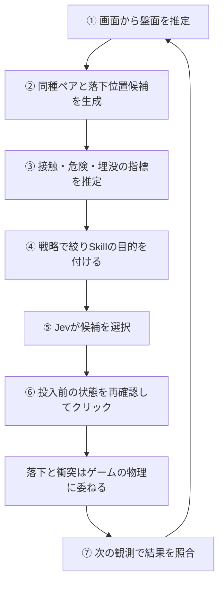

# スイカゲーム：知識を構成しても得点効果が出にくかった事例

更新日：2026年9月26日。[全体比較](01-overview.md)／[テトリス](02-tetris.md)／[マリオ](03-mario.md)

## 結論と終了判断

複数の戦略、Skill、候補生成、埋没対策を改善したが、継続的な得点向上を確認するには至らなかった。**今回の画像観測と投入位置だけを操作する構成では、オントロジー導入の効果を得点へつなげにくかった事例**と捉える。

これは単なる失敗記録ではない。意味を定義することと、その意味に沿った結果を予測・実現・確認できることの間に、大きな隔たりがあったという学びである。ユーザー判断で検証を終了し、サーバーも停止した。4万点超えの目標達成は確認していない。

## 対象と構成

出世スイカゲームを画像認識し、通常のマウス入力で操作する。後半はローカル版を使用した。戦略は隠れた物理状態を読まず、種類・位置・大きさ等を画面から推定する。

画面 → 構造化した盤面 → 関係・指標 → 候補位置を最大7つに絞る → Jevが選択 → 投入 → 次の画面と照合、という流れ。後半はJevの直接API接続を用いた。

定義には同種、階級、合体後の種類、位置関係があり、推定には接触相手、危険余裕、合体経路、上下順がある。戦略として直接合体、駒数削減、大きな同種ペア優先、連鎖、埋没回避を試した。

SkillはDirectMerge（直接合体）、InduceMerge（既存ペアの間接合体）、PlaceSafely（安全性・上下順を考慮する配置）を用いた。名前は目的を表し、成功や安全の保証ではない。

## セマンティックは定義できたが、kineticsの成功条件が難しかった

セマンティックでは、駒・種類・階級・同種・合体先・上下・支持といった対象や関係を定義できた。ただし、関係を定義できることと、画像から正確に判定できることは別である。

kineticsは、落下、接触、押し出し、回転、滑り、合体、それに伴う周囲の再配置である。「対象ペアが合体する」という局所的な成功は定義できる。しかし、**得点・空間・小さい駒の孤立・将来の合体経路まで含めて、その動きを成功と呼べる条件を定めることが難しかった。**

例えば、直接合体しなくても衝突で別のペアが合体すれば有効な手になり得る。一方、合体して得点が増えても、その動きで小さい駒が大きい駒の下へ潜れば、将来の手を失う可能性がある。空き面積が同じでも、空間の位置や形が違えば次の投入のしやすさは変わる。

ここには「結果を予測しにくい」だけでなく、「何を良い結果とするかが複合的で、盤面や評価する手数に依存する」という問題がある。kineticsが揺らぐから成功条件が論理的に定義不可能なのではなく、今回の近似と観測では、実用的な成功条件を構成して扱うことが難しかった。

## どの情報が判断知か

**RDF／OWLは使わず、JavaScriptのオブジェクト・関数・条件分岐・Jevへの説明文で表現した。** 以下は検証終了時の構成である。

| 区分 | 内容 | コードでの表現 | 限界 |
|---|---|---|---|
| 対象・属性 | 観測した駒、種類、位置、大きさ | `scene.pieces`、`kind`、`x,y`、`halfWidth,halfHeight` | 観測間で同じ駒を追跡する永続IDがない |
| 関係 | 同種、合体先、最初の接触 | `sameKind()`、`mergesInto`、`describeCandidates()` | 同種以外の多くは画像に基づく推定 |
| 目的 | 指定ペアを合体させる | `pairGoals()`、`skillFor()` | 目的があることは達成可能性の証明ではない |
| 指標・戦略 | 危険余裕、埋没リスク、ペアの大きさ | `selectPairFirst()`、`mergeAccess`、`PAIR_INSTRUCTIONS` | 指標同士が競合し得る |
| kineticsの予測 | 接触位置、押す方向 | `describePushContact()`、`contactEvidence` | 力・回転・衝突の連鎖をシミュレーションしていない |
| 成功・中断 | 対象合体との整合、投入前の状態変化 | `assessSkill()`、`authorizeClick()` | 投入後の軌道は修正できず、結果判定も不明が多い |

## 一手を決めて結果を確認するフロー



以下は実コードの抜粋または明記した説明用の省略例。全体はpolicy.mjs（ローカル検証資料：`web-player/policy.mjs`）が接続している。

### ① 画像を構造化した盤面へ変える

ローカルの画像認識で`scene`を作り、`prepare()`内の`validate(scene)`で構造を確認する。対象は`scene.active`、`scene.next`、`scene.pieces`などに分ける。これはゲーム内部の正本状態ではなく、見えている範囲の推定である。

### ② 同種ペアと投入位置を候補にする

`pairGoals()`は既存の駒の組み合わせについて種類を比較する（抜粋）。

```js
const a = s.pieces[i], b = s.pieces[j];
if (!a.kind || a.kind !== b.kind) continue;
```

さらに距離などの条件を確認して目標ペアを作り、`pairPositions()`がペアの外側などの位置を追加する。ここで定義しているのは「何を合体させたいか」と「どこから働きかけるか」の候補であり、実際に合体する軌道ではない。

### ③ 候補位置の影響を推定する

```js
const raw = describeCandidates(s, profile.candidatePositions(s, strategy));
```

各候補に最初の接触種類、危険ラインまでの余裕、合体の位置合わせ、次の合体相手を覆う推定などが付く。テトリスの`place()`と違い、実ゲームと同じ物理計算を再現しているわけではない。

最後の修正では`describePushContact()`に接触種類・高さ・横ずれの条件を追加した（抜粋）。

```js
const kindMatches = c.firstContactKind === p.kind;
const supported = kindMatches
  && verticalError <= Math.max(8, p.halfHeight * .25)
  && offset >= .15 && offset <= .85;
```

条件を満たしても、対象へ接触する幾何的な裏付けがあるという意味に留まる。押す力の大きさ、対象がどこまで動くか、合体するかは保証しない。閾値は検証用の仮定で、学習で得た最適値ではない。

### ④ 戦略で候補を絞り、目的を記述する

`profile.select()`が候補を絞り、次手の簡易評価・補正情報を付ける。Skill形式を使う場合は次の処理で目的を付加する。

```js
if (decisionMode === 'skills-v1')
  candidates = candidates.map(c => ({...c, skill: skillFor(s, c)}));
```

例えば`pairGoal`を持つ候補は`InduceMerge`として、対象ペア、落下位置、期待結果、投入前の中断条件を持つ。ABBA比較の従来形式では同じ候補戦略を使うが、このSkill形式の付加は行わない。画面のSkill名だけから、どの形式でJevへ渡したかを決めつけない。

### ⑤ Jevは候補から一つを選ぶ

要求の要点を抜き出した説明用コード：

```js
questions: {
  drop: {
    type: 'choice',
    instructions: profile.instructions(),
    criteria: Object.fromEntries(candidates.map(c => [c.id, c]))
  }
}
```

`resolveAnswer()`は返されたIDが候補に含まれるかを検証する。Jevには、コードが提示していない当て方を直接選ぶことはできない。候補生成で有効な手を落とす問題も、根拠の薄い手を優先する問題も、選択モデルだけでは解決しない。

### ⑥ 投入前には中断できるが、投入後は直接修正できない

`authorizeClick(ticket, fresh)`が新しい観測と判断時の状態を照合する。駒や画面の状態が変化していれば投入を認めず、適切な条件で再観測する。入力後の結果が不明な場合は、同じ駒を重ねて投入しないため停止することがある。

これはマリオの「対岸へ着地するまで右を押す」とは違う。**Skillの目的は保持できても、落とした駒へ途中から入力して向きや勢いを直す操作はない。** 停止できるのは次の投入などであり、すでに起きている衝突を取り消せるわけではない。

### ⑦ 次の観測と目的を照合する

`assessSkill()`は前後の種類・個数・位置・加点などから結果を判定する。しかし、認識が弱ければ次のように不明として残す。

```js
if (![...s.pieces, ...after.pieces].every(strong))
  return result('unknown', 'weak-detection');
```

この条件は対象以外の駒の弱い認識でも判定を止めるため、複雑な盤面で不明が増えやすい。また、ペア優先のSkill生成では`successor: null`としており、後継種類を必要とする合体成功の照合にも制約がある。成功判定器の保守的な設計・未整備も影響しており、不明件数をそのままゲーム自体の予測不能性とみなしてはいけない。

加点だけを成功とせず、不明を残す姿勢は必要だったが、結果として「どの当て方が効いたか」を自動で学ぶための十分な評価データを得られなかった。

## 改善の経緯

| 改善 | 狙い | 分かった限界 |
|---|---|---|
| 対象・関係と戦略の分離 | 意味を変えず戦略比較 | 関係自体の推定誤差は残る |
| 上下順・相手保護 | 小さい駒の埋没を抑える | 他のフィルターと競合し有効候補を落とす |
| 駒数削減・コンボ | 盤面を空け得点を得る | 駒数減少だけでは将来の良い配置を保証しない |
| 間接合体Skill | 衝突で既存の同種ペアを近づける | 候補が出ない時期と、根拠が薄い候補を多く出す時期があった |
| ペアを先に選ぶ | 大きな合体目標から落下位置を考える | 対象への力の伝播が未モデル化 |
| 小さい駒の進入経路保護 | 新たに覆う候補を下げる | 調査ログで新規検出0件。衝突後に潜り込む現象も扱えない |
| 接触種類・高さ・横ずれ | 当て方の裏付けを確認 | 最後の実行は停止し、完走比較に至らず |

## ユーザー観察が示した2つの難しさ

**第一に、合体させたいペアが分かっても、衝突させる位置が悪ければ合体しない。** 対象を選ぶ判断と、対象を動かせる入力を選ぶ判断は別である。画面の「間接合体」は狙いを表すだけで、実現可能性が正しい証拠ではない。

**第二に、最初は小さい駒を覆っていなくても、投入後の衝突で大きい駒の下へ移動する。** 現在の位置関係だけを見る埋没対策では防げない。回転、滑り、支持の変化、周囲への押し出しを含む結果モデルが必要になる。

この観察は成功条件の難しさにつながる。「対象の2駒が合体した」は局所的には明確だが、それだけでは良い一手とは限らない。空間を保つ、小さい駒を取り残さない、次の合体経路を残すといった副作用まで含めると、条件が競合し、評価時間も複数手へ広がる。

## 記録に残った結果

9月23日の既存集計ではstack-first-v1の4ゲームが平均8,067.5点、最高10,280点。別版の2ゲーム平均7,015点、さらに別版の1ゲーム8,840点という記録がある。ただし少数・実行版が異なり、戦略の優劣比較ではない。除外ゲームも86件あり、完走条件を揃える難しさがあった。

9月25日の間接合体調査はrun `60b49e26-54ce-4a36-8058-3ca52dfb8602` の53投を対象とした。途中再開を含むため独立試行ではない。

| 観点 | 結果 |
|---|---:|
| 対象ペアと最初の接触種類が一致 | 32/53 |
| 接触種類が別 | 21/53 |
| 両対象が認識信頼条件を満たす | 26/53 |
| 次の観測で得点増加 | 16/53 |
| 得点変化なし | 37/53 |
| 対応付けによる距離減少の推定 | 3/53 |
| 距離の変化が小さい推定 | 17/53 |
| 距離増加の推定 | 1/53 |
| 距離変化の判定不能 | 32/53 |

得点増加は別の合体でも生じる。距離変化も永続IDによる追跡ではなく、近傍の同種検出を保守的に対応付けた推定である。これを合体成功率とは呼ばない。前後画像の目視照合は代表2例で、全53例の目視判定はしていない。

同じ調査で投入確認113件のSkill成否は全て不明、うち107件が認識の弱さによるものだった。6,510点の終了記録があるが途中再開を含む。新規の進入経路保護は候補削減前も0件だったため、「埋没を防げた」証拠ではない。

最後の接触条件修正版はrun `da80e38c-35bb-499a-8360-0c91da73c7cb`。投入確認94件、最大観測4,800点、95手目の投入後確認で停止し、ゲームオーバー記録はない。複数の開始試行を含み、4,800点を完走得点や修正の悪化証拠に使わない。その後ユーザーの指示で検証とサーバーを終了した。

## なぜうまくいかなかったのか

**セマンティックの定義から、望ましいkineticsを実現・評価するまでのつながりが弱かった。** 合体という目的を与えるだけでは、適切な当て方も、盤面全体の良い結果も決まらなかった。

| 問題 | 根拠・確かさ | 得点改善への影響 |
|---|---|---|
| 接触から対象までの関係が弱い | 調査53投中21投で接触種類が対象と別。コードは力の伝播経路を計算していなかった | 届く裏付けが弱い手も間接合体として優先された |
| 当て方が目的に結びつかない | 代表2例の前後画像で対象ペアが残り加点なし。距離照合も17件は変化小、32件は不明 | 有効な押し方と無効な投入を十分に区別できない |
| 良い結果の定義が複合的 | ユーザー観察では衝突後の小さい駒の潜り込みもあった。発生率は未測定 | 直接合体・得点だけでは、空間や将来経路の損失を評価できない |
| 静的な埋没対策では足りない | 新規の経路保護検出は調査ログで0件。回転・滑りの予測もない | ルールが有効な場面を捉えたか確認できず、動的な埋没を防げない |
| 投入後の修正操作がない | 今回の操作は落下位置の指定に限定 | 想定から外れても同じSkillの実行中に軌道を修正できない |
| 成否を自動評価できない | 113投全て不明、107投が認識条件で不明。成功判定の実装にも制約 | 予測と結果の差から方策を改善する循環が弱くなる |
| 完走比較が不足 | 画面位置・サイズ等に伴う停止、途中再開を記録 | 方策の良し悪しと実行基盤の問題を分離しきれない |

この表にはログで確認した実装上の問題と、観察から得た設計上の示唆がある。どの要因が得点停滞の何割を説明するかまでは測定していない。「Jevが悪い」「オントロジーが誤り」「物理そのものが乱数」と一つの原因へまとめる根拠もない。

それでも、意味とSkillを整備するだけでは効果につながらず、予測・観測・評価の追加コストが大きかったという結果は残る。これを、今回の条件ではオントロジーを得点向上へつなげることに成功しなかった事例として扱う。

## 学び：他の2ゲームとの対比

**セマンティックを定義できることだけでは、オントロジーの適用効果は保証されない。kineticsの成功条件を定め、その条件へ操作を結びつけ、結果を照合できるかが分かれ目になる。**

テトリスでは消去を含む次の状態をエンジンで計算できる。マリオのv16では目的を達成するまで観測して操作を調整できる。スイカは投入後に修正できず、結果が多数の駒に波及するうえ、観測も不完全だった。

したがって「成功条件を作れば改善する」だけでは足りない。**その条件を実現する操作を選べること、結果を観測できること、局所成功が全体目標につながること**まで必要だった。

## 今後再開する場合の条件

ルールを追加するだけの再開は優先しない。対象追跡による判定可能率の改善、局所的な衝突予測、同じ場面を再試行できる検証環境など、現在の制約を変えられる場合に再検討する。本書は再開の約束ではなく、終了時点の学びを保存するもの。

## 根拠

- 関係と戦略の分離（ローカル検証資料：`web-player/docs/knowledge-strategy-map.md`）
- 旧時点の比較・得点集計（ローカル検証資料：`web-player/docs/suika-tetris-ontology-comparison.md`）
- 間接合体53投の調査（ローカル検証資料：`web-player/docs/indirect-merge-audit-2026-09-25.md`）
- 前後画像一覧（ローカル検証資料：`web-player/runs/push-audit/index.html`）、距離変化の推定（ローカル検証資料：`web-player/runs/push-audit/motion.json`）
- 接触条件と優先順位の実装（ローカル検証資料：`web-player/strategies/pair-first.mjs`）

調査資料の「実プレイ前」はその資料を書いた時点の記述である。本書ではその後の開始・停止まで反映した。公開共有する場合、ローカル画像・ログのリンクは別途持ち出す必要があり、自動的に公開されるものではない。
